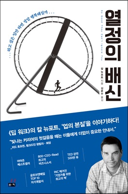

### 뭐라도 해야됐던 시절

&nbsp; 20대 때는 열정 가득했고 개발에 입문하는 순간까지도 노력은 했지만 순탄치 않았다. 처음에는 회계사 공부를 했었는데 2년간 공부하고 관뒀다. 또, 워킹홀리데이로 지냈던 호주로 돌아가고 싶어서 요리 학교 준비를 몇 달 하다가 또 때려치우고 느지막하게 26살부터 개발을 시작했다. 당시에 유명했던 김포프의 유튜브를 보면서 열정을 가득하게 얻고 C언어 공부로 입문했었다. 게임 개발이 하고 싶었고 어딘가에서 찾은 게임 개발자 테크트리를 찾아서 언리얼, 유니티, 다이렉트x 마구잡이로 공부했지만 뭐 하나 제대로 만들지 못했다. 졸업 직전에는 취업이라도 하고 싶어서 머신 러닝이 유망하다는 소리에 관련 책도 읽어보고 이것저것 많이 했었다. 결과적으로는 졸업하고 나서 뒤늦게 우연히 보게 된 노마드 코더의 니콜라스에게 끌려서 프론트앤드 개발자가 되었고 지금도 프론트앤드 개발자로 개발자 인생을 이어 가고 있다. 이 책의 저자는 20대의 내가 한 실수들과 지금 나의 상황에 대해서도 어느 정도 설명을 해준다.

### 책에서 말하는 열정

&nbsp; 저자는 자신의 천직이 뭔지 먼저 파악한 다음 거기에 맞는 직업을 찾아야 한다는 열정론을 부정한다. 마치에 운명처럼 자기한테 맞는 직업을 찾고 열정을 가지고 꾸준히 하면 성공한다는 평소 자기 계발 서적에서 많이 볼 수 있는 내용이다. 이와 같은 열정론은 환상을 심고 대부분 환상이 이뤄지지 않기 때문에 사람을 지치게 하고 역으로 불행하게 만든다고 말한다. 대부분 열정으로 성공했다고 생각하는 스티브 잡스를 대표적인 예로 드는데, 사실 스티브 잡스의 열정은 철학이나 마약 같은 자유로운 삶에 있었으며 그의 성공은 사실 매킨토시를 팔게 된 우연한 사건 때문에 시작되었다고 한다. 그가 쫓던 환상에 휩싸인 열정이 아니라 매킨토시의 성공이라는 우연한 구체적인 커리어 자산이 그의 성공을 만들었다고 한다. 일반적인 시선으로는 운명적인 열정이 먼저고 그 후에 커리어 자산이 생기고 행복한 성공에 다다르지만, 저자의 시선으로는 커리어 자산이 먼저 쌓이고 나서야 열정이 생기고 만족하는 삶에 다다르게 된다.

&nbsp; 위의 관점으로 보는 나는 어떨까, 나는 항상 뭔가 환상에 빠진 열정 가득한 지망생이었고 노력은 했지만 노력한 만큼 뭐 하나 제대로 커리어 자산을 구축하지 못했다. 졸업 후 우연히 프론트앤드 개발을 시작했지만 사실 이때도 열정이 앞섰고 HTML, CSS부터 시작해서 Javascript, NodeJs, React 까지 두 달 만에 공부할 정도로 열정만 가지고 간절하게 뭔가를 했었다. 석 달 정도 됐을까 무리한 학습 일정에 점점 지쳐갈 무렵 운이 좋게 티몬의 인턴 자리를 생각보다 빨리 얻게 되었고 프론트 개발자로 커리어를 시작하게 되었다. 이때부터 뭔가 톱니들이 맞아갔던 것 같다. 지속해서 공부하고 일했고 회사에서 인정도 받았다. 결과적으로 일에 대한 만족도가 올라갔고 더 큰 열정을 가지고 개발자에 임하게 되었다. 또, 그렇게 점차 키워간 커리어 자산으로 이직도 하게 되었다. 지금 와서 생각해보면 운이 좋게 좋은 시점에 커리어를 시작할 수 있었다. 이른 시작을 하지 않았다면 다시금 열정이 고갈되고 개발에 대한 만족도가 많이 떨어졌을 것이다. 그 시점에서 다시 내 열정이 어디로 튀었을지는 감히 예상도 되지 않는다.

### 커리어 자산을 쌓는 법

&nbsp; 저자는 같은 노력을 하더라도 새롭게 도전하고 피드백 받아야 장인이 된다고 한다. 프로 체스 선수들의 예를 들면서 당장 실전 경험보다는 연구를 통한 의식적 훈련이 성장의 키라고 말한다. 실전만 하다 보면 너무 쉬운 걸 쉽게 해결하거나 어려운 건 해결 못하기 마련이기 때문에 어려운 문제를 의식적으로 학습하고 이걸 다시 실전에 도입할 때 성장한다. 그 과정에서 핵심은 피드백이다.

&nbsp; 저자의 팁을 개발자가 커리어 자산을 쌓는 과정으로 대입시켜보자. 개발자의 커리어 자산은 다양한 부분이 있겠지만 개발 능력만 생각해서 대입해 보겠다. 열심히 사이드 프로젝트며 회사 프로젝트며 같은 노력을 한다는 전제하에 계속 비슷한 스타일로 코드를 짜기보단 도전하면서 더 개선된 새로운 스타일로 개발해야 발전을 한다. 또, 선임 개발자의 코드 리뷰로 피드백 받으면서 바른 방향으로 개선을 해야 한다. 또, 너무 쉬운 작업은 실력 향상에 도움이 안 되고 또 너무 어려운 작업은 해결을 못 하기에 도움이 안 된다. 실력 향상을 위해서는 무작정 무수한 작업에 뛰어들기 보다는 어려운 작업 하나를 의식적으로 연구 학습해서 기존에는 못했던 어려운 작업을 할 수 있도록 해야 한다. 이 과정에서도 물론 선임 개발자의 피드백이 중요하다.

### 자율성

&nbsp; 저자는 위와 같이 커리어 자산을 쌓은 후에는 이것을 투자해서 뭔가를 얻어낼 때 만족도가 올라간다고 말한다. 그중 하나는 자율성이다. 책에서 말하는 자율성은 좀 포괄적인 의미인 것 같다. 단순 직장인으로 보면 유연 근무제나 많은 휴가, 적은 근무 시간 같이 시간적인 자율의 의미도 있고 하던 일 다 팽개치고 열정을 가지고 뛰어들만한 일에 뛰어드는 그런 자유로움도 있다. 후자는 오래 일해온 직장을 때려치우고 전업 유튜버가 된다 더 느는가의 자유다.

&nbsp; 개발자에게 주요 커리어 자산 투자처에 해당하는 전자의 자율성을 말해보겠다. 전자의 자율성은 나의 실력을 기반으로 고용주와 협상해서 얻어내는 것들이 대부분이다. 많은 좋은 IT기업들이 이 자율성을 가지고 좋은 개발자를 유치하기 위한 협상 도구로도 많이 사용한다. 주 32시간제를 하는 회사도 생겨나고 있고 휴가도 무제한인 곳이 많다. 최근에는 코로나 이후 재택근무 여부로 회사와 근로자들이 많은 갈등을 가지는 것을 자주 볼 수 있다. 주어진 자율성을 뺏는 것은 늘 고용주가 원하는 것이고 이를 근로자들이 잘 알기 때문에 민감한 문제 같다. 고용주는 근로자들이 원하는 환경을 조성하지 못하면 그들의 커리어 자산을 받을 수 없게 되고 인재 영입 전쟁에서 뒤처지게 된다. 근로자는 또 그들의 커리어 자산이 정당한 대우를 받지 못한다고 생각하면 삶의 만족도가 떨어지게 된다.

### 마치며

&nbsp; 삶의 자세에 관한 책이기 때문에 생각과 사례에 따라서는 이 책이 틀릴 수도 있고 열정론이 맞을 수도 있다. 그런데도 이 책을 읽으며 20대를 돌아볼 수도 있었고 지금 내가 서 있는 위치도 어느 정도 유추해볼 수 있었다. 또, 어디로 어떻게 가야 하는지도 알게 되었다. 아직은 커리어 자산을 쌓아가는 중이지만 이를 토대로 자율성이나 사명감에 투자한다면 좀 더 만족스러운 삶이 될 것 같다.

### 이 책의 저자는 말한다

_열정은 허상이고 실력이 실체다_
