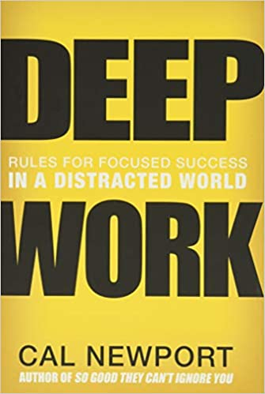

### 이 책을 읽게 된 이유

&nbsp; 열정의 배신을 읽고 칼 뉴포트의 책을 더 읽고 싶어서 읽게 되었다. 개발과 관련된 개인 공부를 하려고 여러 가지 시도를 해보고 있다. 아침시간 / 저녁시간처럼 공부 시간을 바꿔서 시도해보고 있고 노션에 칸반을 만들어서도 일정 관리도 하고 있다. 문제는 작심삼일로 결국 뭔가 의지력이 고갈되고 정량적으로 발전하는 느낌이 들지 않는다. 그 와중에 제대로 쉬고 있는지도 의문이고 벌써 올해도 한 달이 지났다. 진작 읽었어야 할 쌓여 있는 개발 서적들은 계획과 다르게 읽히지 않은 채 방치되고 있다. 딥 워크를 읽고 답을 찾기를 원했다.

### 1부 왜 딥 워크인가

&nbsp; 1부에서 저자는 딥 워크의 필요성에 대해서 말한다. 성과는 집중 강도 X 시간의 결과물이기에 딥 워크를 함으로써 집중 강도를 높이면 적은 시간을 들이고도 높은 성과를 낼 수 있다. 집중하지 않으면 주의 잔류물이 남고 이는 또 집중 강도를 떨어뜨리는 악순환을 일으킨다. 보통 생산성은 측정하기 어렵기 때문에 대다수 직장인은 분주하게 일을 하려고 하고 또 이 것을 생산성이 높은 것으로 착각한다. 예를 들면 이메일을 빠르게 많이 보내는 게 일을 잘하는 것으로 생각한다. 이런 피상적인 일들은 스트레스만 늘려서 딥 워크를 하는 데 방해를 주고 결과적으로 생산성을 떨어뜨린다. 딥 워크를 하면 몰입을 하게 되고 일과 삶에 의미를 부여하고 만족도가 높아지게 된다.

&nbsp; 나는 보통 하루에 14시간은 책상에 앉아 있다. 재택 근무 중이기도 하고 일 할 때도 쉴 때도 인터넷을 하면서 모든 일상이 이뤄진다. 주식, LCK, 유튜브, 회사 개발업무, 개인 개발공부, 롤토체스, 쿠키런킹덤, 인스타그램 등 요즘의 관심사들이다. 특히 뭔가 지식에서 얻는 만족감이 크기 때문에 유튜브에서 피상적인 지식 컨텐츠들을 많이 본다. 이런 습관들이 얇고 넓은 나의 지식세계에는 도움이 됐을지언정 정작 집중하고 싶은 개발 공부는 집중하지 못하게 만들었던 것 같다.

### 2부 딥 워크의 규칙

&nbsp; 2부에서 저자는 딥 워크를 적용하는 방법에 관해서 설명한다. 의지력은 결국 고갈되는 자원이기에 습관과 의식을 만들어야 한다고 한다. 인터넷과 TV의 유혹을 이기려는 의지력 소모를 최소화하는 방향으로 규칙을 만들고 딥 워크 훈련을 해야 한다. 여러 방법을 소개하고 있는데 보통 일반인 기준으로는 운율적인 방식이 가장 맞을 것 같다. 하루의 일정 시간을 정해서 이때 딥워크를 하는 방법이다. 주의 집중을 극대화하는 딥 워크 의식 만드는 법도 소개하고 있는데 장소와 시간을 고정 하고 구체적으로 해야 할 일 / 하지 말아야 할 일을 정하면 의식을 만드는 데 도움이 된다고 한다. 보조 수단으로 좋은 커피나 간단한 운동도 도움이 될 것이다. 4DX 방법론도 소개한다. 목표를 수립하고 시간을 지표로 삼고 점수판을 만들어 정기적으로 점검하는 방식이다. 일과가 끝나면 일에 신경을 쓰지 않는 것도 필수적이라고 한다. 휴식기에 통찰력이 높아지고 무의식이 강화되고 또 집중력도 높아진다. 일과 마무리 시에 내일 구체적인 계획을 세우는 것은 일로부터 빠른 해방을 도와준다. 인터넷도 정해진 시간에 해서 잦은 주의 전환으로부터 오는 뇌의 극심한 피로를 피해야 한다고 한다.

&nbsp; 나는 개인 개발 공부에 딥 워크를 적용해보려고 한다. 위에서 말한 대로 운율적인 방식을 채택하기로 했다. 새벽 시간에 공부하려고 하는데 이른 시간이면 다들 자고 있어서 메신저 등으로 방해를 덜 받을 것 같고 딱히 주의를 방해하는 이슈들도 생기지 않는다. 또 이 시간 동안은 핸드폰을 하지 않고 생산성에 도움이 되는 인터넷만 쓰려고 한다. 구체적으로 뽀모도로 방법으로 시간 측정을 하고 잘 된 날은 달력에 표시를 할 것이다. 50분 집중하고 10분간 휴식을 하려고 하는데 이때 간단한 스트레칭이나 토스트 굽는 등 일과를 하면 될 것 같다. 7시 이후로는 내일 일과를 세운 뒤 휴식을 취하려고 하고 영화나 스포츠 시청을 하려고 한다. 정리해보면 다음과 같다.

- 방법
  - 운율적인 방식
- 시간
  - 5시 30분 - 6시 30분 : 딥 워크에 도움이 되는 간단한 운동과 샤워
  - 6시 30분 - 10시 : 딥 워크 시간 - 개인 개발 공부
  - 19시 : 내일 일과 세운 뒤 휴식
- 규칙
  - 핸드폰, 정해지지 않는 인터넷 금지
  - 시간 적어서 점수 체크 / 잘되면 달력에 표시

### 마치며

&nbsp; 이걸 쓰는 와중에도 엄청난 유혹이 온다. 인터넷과 소셜미디어는 자극적이기 때문에 계속 보게 된다. 적어도 딥워크 시간 만이라도 생산성을 높여서 개발자 커리어에 도움이 되기를 원한다. 저자는 딥워크를 위해서 완벽한 고립을 선택했지만 나는 그럴 용기가 부족하기에 새벽과 아침 시간 만이라도 고립을 해보려고 한다. 일단 100일간 해보려고 하는데 100일 후에 긍정적인 후기를 남겨볼 수 있기를 소망한다.

### 이 책의 저자는 말한다

_습관을 뜯어 고쳐서 딥 워크 하게 되면 성과가 올라간다_
