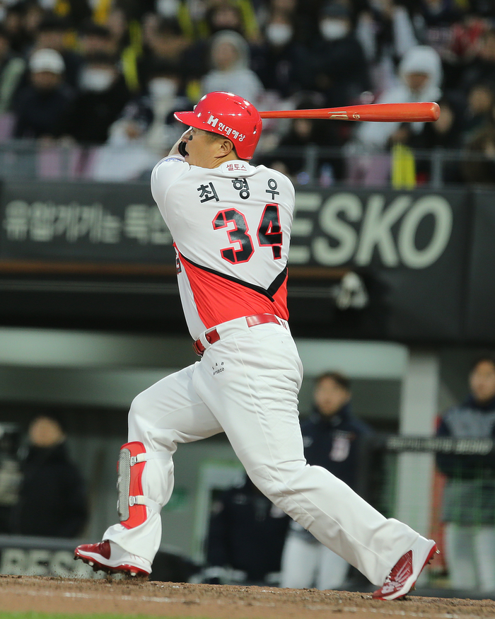

&nbsp; 5년 동안 열심히 노력해왔습니다. 매 순간 최선이라고 생각하는 선택들을 꾸준히 실천했지만 지금도 여전히 불안하고 방황하는 기분이 듭니다. 주변에는 항상 능력 있는 동료들이 있어 배우는 것이 많았고 항상 최선을 다했지만 여전히 아쉬움이 더욱 큽니다.

### 최선을 다함에 대해서

> "최선을 다한다"는 주로 어떤 일을 수행할 때 특히 노력하고 열심히 노력한다는 의미를 담고 있는 표현이다. 이 말은 개인이나 그룹이 주어진 상황에서 최대한의 노력과 능력을 발휘하고, 어떤 목표를 달성하기 위해 최선을 다한다는 다짐과 의지를 나타낸다.

&nbsp; 최선을 다한다는 것은 자신이 바른 길에 있다는 신뢰감을 줘서 동기부여가 되고, 목표를 향해 노력하게 합니다. 목표를 달성한다면 성취감을 느끼게 되어서 다시 최선을 다하려는 의지를 가져오고, 이는 다시 목표 달성으로 이어지는 선순환 구조를 만듭니다. 하지만 '최선을 다한다'라는 말에도 함정이 있는데, 주어진 상황에서만 최선을 다하게 되면 그 상황에만 맞는 성장만 이루게 됩니다. 그 성장이 본인이 생각하기에 바른 방향이 아니였으면 상대적인 역성장이 될 수도 있습니다.

### 최선을 다한 운동선수

&nbsp; 운동선수와 개발자는 상당히 유사한 면이 있습니다. 둘 다 팀에서 일하고, 팀으로부터 성장 지원을 받으며, 최선을 다하도록 요구 받습니다. 다양한 팀과 환경에서 최선을 다해야 하며, 특정 상황을 이겨내기 위해 훈련을 받습니다. 저의 경우, 프로야구를 자주 보는데 선수들이 훈련 받고, 많은 코치들을 만나며 매번 변화된 다양한 폼을 만드는 것을 봤습니다. 선수들은 코치들이 주문 한대로 최선을 다해 훈련을 합니다. 그러나 묘하게도 재능 있는 선수들이 매 시즌 투구 폼이나 타격 폼을 바꾸어도 크게 성장하지 못하는 경우가 많았습니다. 오히려 아무것도 몰랐던 신인 시절보다 못하는 경우도 많았습니다. 그들이 재능이 없었던 것은 아니였습니다. 그 선수들이 다른 팀으로 이동하거나 다시 기회를 잡으면 주축 선수가 되는 경우도 많았기 때문입니다.

### 최선을 다한 개발자

&nbsp; 개발자도 운동선수처럼 주어진 환경에서 훈련을 받고, 매니저로부터 할당받은 업무를 수행하며 성장합니다. 저는 커리어의 대부분을 커머스의 프론트엔드 개발을 했습니다. 커머스 개발은 신속하게 변화하며, 일정과 리소스가 상대적으로 부족한 상황에서 개발이 이루어집니다. 깊이 있는 코드 리뷰나 구조적인 고민보다는 기획자가 제공한 스펙을 이해하고 빠르게 배포하는 것이 칭찬을 받는 환경이었습니다. 이로 인해, 구현을 신속하게 진행하는 능력에 초점을 맞춰 훈련받았습니다. 바쁜 업무에 대응하기 위해 오늘 또 일을 미루고 말았다, 업무 시각화나 일하는 뇌와 같은 업무 주도적인 서적을 많이 읽었습니다.

&nbsp; 최근에는 빠른 업무보다는 좋은 구조와 코드에 관심을 가지는 프로젝트로 전환하게 되었습니다. 코드 리뷰를 받으면서 내 코드의 품질이 상대적으로 낮다는 사실에 놀랐습니다. 빠른 개발에 초점을 맞춘 결과, 실력은 증가했지만 코드 측면에서는 역성장하게 된 것이었습니다.

&nbsp; 상황을 만드는 회사와 매니저는 때때로 이기적일 수 있습니다. 빠른 개발과 일정 내의 완료하는 것을 주문하지만, 추후 코드 품질이 저하되고 이로 인한 부작용이 발생하면, 상황에 최선을 다한 개발자를 비난하기도 합니다. 남아있는 코드의 기록들이 저를 부끄럽게 합니다. 이는 최선을 다한 개발자에게 큰 상처를 남기며, '최선을 다한다'는 선순환 고리를 파괴하여 그로 인해 더이상 최선을 다할 수 없는 상황을 만들어 낼 수 있습니다.

[최선을 다함에 대해2](/do-my-best-2)로 이어집니다
