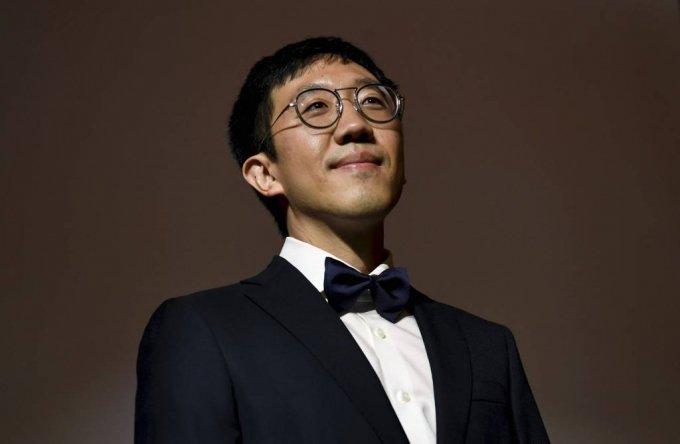

&nbsp; [앞선 글](/do-my-best-1)에서는 최선을 다하는 것에 대한 맹점을 썼다. 주어진 환경에서 단순히 성실하게 최선을 다 한다면 상황에 휩쓸려 자기가 원하는 모습이 아닌 전혀 다른 모습으로 성장이 되어 역성장이 될 수 있다. 지난 글에서 방출된 야구 선수가 기회를 다시 잡고 크게 주축 선수가 된 경우가 많다고 하는데 이는 어떤 차이가 있을까 또 나에게 대입하면 어떤 모습이 필요할지 생각해보았다.

### 방향 설정하기

&nbsp; 일단 방출당한 야구 선수들은 대부분 군대 복무를 마치거나 큰 충격을 겪은 후 다른 팀의 트라이아웃(선수 선발 행사)에 참가해, 다시 야구장에 복귀한다. 이때 그들은 특별한 코치의 도움 없이, 스스로의 힘으로 길을 찾아야 한다. 그 결과, 주도적으로 무언가를 해야 하는 상황에 처하게 된다. 그동안은 코치가 설정해준 방향대로 훈련을 해왔지만, 이제 자유롭게 된 그들은 자신이 진정으로 원하는 야구의 모습이 무엇인지 고민하게 된다. 이를 통해 스스로를 진단하며, 훈련을 계획하게 된다. 자신이 원하는 방향이 확실해지고 나면, 더 이상 코치만을 따르는 것이 아니라 진정으로 자신이 원하는 야구를 추구할 수 있는 힘이 생긴다.

&nbsp; 최선을 다하기 전에 나는 어떤 방향으로 가고 싶은지, 현재 상황에서 최선을 다하면 어떤 결과가 나올지 스스로에게 끊임없이 질문해야 한다. 나는 어떤 개발자가 되고 싶은지, 주어진 업무 내용이나 개인적인 학습 환경 등의 영향을 받아 최선을 다할 경우, 어떠한 모습으로 성장할지를 생각해야 한다. 그 과정에서 중요한 것은 일이나 환경이 아니라 '나'가 중심이 되어야 한다는 것이다. 그래서 어떤 방향을 설정할 것인지는 아주 중요한 요소가 된다.

### 주어진 상황에 기민해지기

&nbsp; 주어진 상황에 최선을 다하는 것이 아니라, 내가 선택한 방향에 맞추어 최선을 다해야 한다. 상황은 항상 원하는 대로 되지 않으므로, 나의 원하는 방향과는 다른 결과를 원할 가능성이 있다. 나의 현재 환경은 굉장히 중요한 요소이다. 건조한 땅에서 자라는 잡초도 콘크리트 위에서는 죽는다. 마찬가지로, 손흥민 선수도 지속적으로 프로의 환경에서 축구를 하지 않으면 챔피언스 리그에서 뛸 수 있는 실력을 유지하기 어려울 것이다.

&nbsp; 커머스 개발을 계속 하면서 코드 품질이나 설계 능력을 향상시키기 위해 어떤 일을 할 수 있었을까? 일상적인 업무 환경에서는 매우 바쁘게 업무가 진행되기 때문에 그런 방향으로 개발을 하는 것이 어렵다. 그렇기에 업무 외적으로 따로 시간을 내어 사이드 프로젝트를 진행하며 1인 개발자가 되어 설계 능력을 기르거나 클린 코드를 학습하고 적용해보는 등의 활동을 할 수 있을 것이다. 야근이나 주말 근무로 인해 그럴 여유가 없었다면 어떻게 해야 할까? 그럴 때는 싸워야 한다. 최소한의 코드에 대한 고민과 설계에 대한 고민을 할 수 있는 여유를 가질 수 있도록 요구하거나, 그게 힘들다면 직장을 옮기거나 프로젝트를 바꿔야 한다. 그만큼 민감하게 반응해야 한다. 원하지 않는 방향으로 계속 노력을 해야 한다면 프로젝트 자체와 나에게 모두 좋지 않은 효과를 가져온다.

### 기록하고 회고하자

&nbsp; 시간은 빠르고 상황은 계속 변한다. 방향을 기민하게 인지하려면 항상 기록하고 생각을 정리하고 회고하고 올바른 방향으로 가고 있는 게 맞는지 확인해야 한다. 최근 글을 남기고 기록하는 게 비효율적이라 생각해서 간단한 마인드맵 수준으로만 정리를 해왔는데 실수였다. 구조적인 글을 남겨야 생각이 온전히 정리가 된다.

### 최선의 결과가 마음에 들지 않을 수 도 있다

&nbsp; 설정했던 방향이 가다보니 내가 원하지 않았던 방향일 수 도 있다. 최선을 다했지만 원하지 않은 모습의 결과를 보고 상처를 얻을 수도 있다. 상처 받지 말고 자신에게 따뜻해 져야한다.

&nbsp; 필즈상을 수상했던 허준이 교수가 모교에서 [졸업 축사](https://www.youtube.com/watch?v=OLDhaqosPtA)를 한 것을 보고 감동을 받은 적이 있다.

> 제 대학 생활은 잘 포장해서 이야기해도 길 잃음의 연속이었습니다. 똑똑하면서 건강하고 성실하기까지 한 주위 수많은 친구를 보면서 나 같은 사람은 뭘 하며 살아야 하나 고민했습니다. 잘 쉬고 돌아오라던 어느 은사님의 말씀이, 듬성듬성해진 성적표 위에서 아직도 저를 쳐다보고 있는 듯합니다. 지금 듣고 계신 분들도 정도의 차이와 방향의 다름이 있을지언정 지난 몇 년간 본질적으로 비슷한 과정을 거쳤으리라 생각합니다. 그리고 이제 더 큰 도전, 불확실하고, 불투명하고, 끝은 있지만 잘 보이진 않는 매일의 반복을 눈앞에 두고 있습니다. 생각보다 힘들 수도, 생각만큼 힘들 수도 있습니다.

> 이제 본격적으로 어른입니다. 실패를 두려워하지 말고 도전하라. 편안하고 안전한 길을 거부하라. 타협하지 말고 자신의 진짜 꿈을 좇아라. 모두 좋은 조언이고 사회의 입장에서는 특히나 유용한 말입니다만, 개인의 입장은 다를 수 있음을 여러분은 이미 고민해 봤습니다. 제로섬 상대평가의 몇 가지 퉁명스러운 기준을 따른다면, 일부만이 예외적으로 성공할 것입니다. 여러 변덕스러운 우연이, 지쳐버린 타인이, 그리고 누구보다 자신이 자신에게 모질게 굴 수 있으니 마음 단단히 먹기 바랍니다. 나는 커서 어떻게 살까, 오래된 질문을 오늘부터의 매일이 대답해줍니다. 취업 준비, 결혼 준비, 육아 교육 승진 은퇴 노후 준비를 거쳐 어디 병원 그럴듯한 일인실에서 사망하기 위한 준비에 산만해지지 않기를 바랍니다. 무례와 혐오와 경쟁과 분열과 비교와 나태와 허무의 달콤함에 길들지 말길, 의미와 무의미의 온갖 폭력을 이겨내고 하루하루를 온전히 경험하길, 그 끝에서 오래 기다리고 있는 낯선 나를 아무 아쉬움 없이 맞이하길 바랍니다.

> 수학은 무모순이 용납하는 어떤 정의도 허락합니다. 수학자들 주요 업무가 그중 무엇을 쓸지 선택하는 것인데, 언어를 어떻게 사용할 것인가에 대한 가능한 여러 가지 약속 중 무엇이 가장 아름다운 구조를 끌어내는지가 그 가치의 잣대가 됩니다. 오늘같이 특별한 날 특별한 곳에서 특별한 사람들과 함께하니 들뜬 마음에 모든 시도가 소중해 보입니다. 타인을 내가 아직 기억하지 못하는 먼 미래의 자신으로, 자신을 잠시지만 지금 여기서 온전히 함께하고 있는 타인으로 받아들일 수 있을까 궁금해집니다. 졸업생 여러분, 오래 준비한 완성을 축하하고, 오늘의 새로운 시작을 축하합니다. 서로에게, 그리고 자신에게 친절하시길, 그리고 그 친절을 먼 미래의 우리에게 잘 전달해 주길 바랍니다. 응원합니다. 축하합니다. 감사합니다.

크게는 두 가지를 말한다.

1. 모순이 없는 한도 내에서는 사람은 어떻게 살 것인지를 자유롭게 정의할 수 있다. 다만 모순의 달콤함에 길들여지지 않도록 하자.
2. 먼 미래의 자신 혹은 먼 미래의 자신에게 지금의 자신은 타인과 같기에 친절하게 대했으면 한다.

열심히 정의하고 고민하고 적용해보고 삶을 풀어 보고 그 순간을 온전히 경험하기를 또 그 시도에 대해 자기에게 너무 모질게 굴지 않았으면 하는 그분의 마음이 잘 느껴졌다.