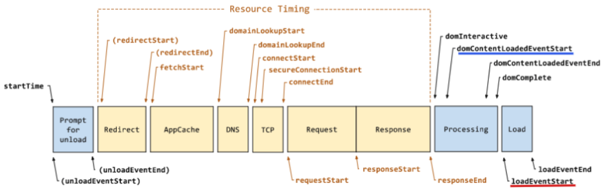
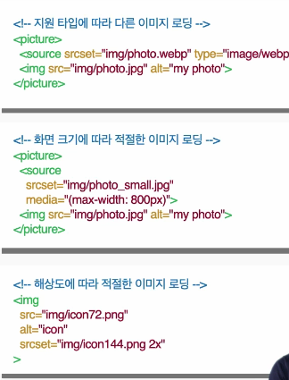
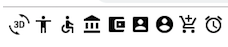

# 웹 성능 최적화란

---

&nbsp; 웹은 무수히 많은 프로토콜과 많은 실행 환경 속에서 동작이 되고 있기 때문에 웹 성능 최적화 위한 방법들을 단순히 정의하는게 쉽지 않다. 웹 어플리케이션은 복합적인 환경에 따라 비슷한 듯 다른 듯 동작하며 같은 데이터를 이용해도 빠를수도 느릴 수도 있다. 또 사용자가 인지적으로 느끼는 성능 향상은 상당히 주관적이다. 지표 상으로 구체적인 성능 향상을 보여도 사용자는 인지 하지 못할 수도 있다.

&nbsp; 성능 최적화는 단순히 각종 비용을 줄이는 측면에서 볼 수 있다. 프로그램은 컴퓨터의 리소스를 소모하면서 동작한다. 소모하는 리소스에는 메모리 사용량, 처리 시간 등이 있다. 처리해야 될 작업이 복잡 하고 클수록 리소스를 더 많이 소모하게 되고 이는 성능 저하로 이어 진다. 웹 프론트앤드 환경에서는 각종 파일들을 주고 받으며 화면을 띄우고 화면을 업데이트하는 과정속에서 비용을 소모한다. 웹 프론트앤드 성능 개선을 위해서 **웹 개발자는 `최소한의 데이터`로 `가장 빠른 시간`에 `사용자가 불편함을 느끼지 않는 최적의 화면`을 띄워야 한다**. 성능 최적화를 하게 되면 곧 사용자 경험의 개선으로 이어지고 기업의 실적으로도 이어진다. 성능 최적화를 위해 어떤 부분을 신경 써야 하며 어떤 전략들을 쓰고 있는지 알아보도록 하겠다.

# 성능 개선 지표

---

&nbsp; 고전적으로는 `DOMContentLoaded 이벤트` 이나 `Load 이벤트` 의 시점이 빠르다거나 `DOMContentLoaded이벤트` 와 `Load 이벤트` 사이의 시간이 짧은 것을 처리시간이 빠르므로 웹 프론트앤드 성능이 좋다고 여겼다.



&nbsp; 현대의 웹 브라우저 환경은 앞선 로드 이벤트와 상관 없이 DOM 생성을 최대한 빨리하고 블로킹을 일으키는 복잡한 스크립트 로직은 비동기적으로 처리하고 있다. SPA 라이브러리 같은 경우도 상당히 연산이 심하기 때문에 비동기적으로 스크립트가 실행 된다 ( 참고 : [DOMContentLoaded, load, beforeunload, unload 이벤트](https://www.notion.so/DOMContentLoaded-load-beforeunload-unload-7bd0d60f6a70437b9d87f391ec017530) ) 최근의 성능 측정에서는 사용자가 직접 느끼는 부분을 중요시 하기 때문에 다음과 같은 사용자 기준으로 성능을 측정한다.

- `FP(First Paint)` : 처음 뭔가 그리기 시작
- `FCP(First Contentful Paint)` : 텍스트나 이미지 그리기 시작
- `FMP(First Meaningful Paint)` : 의미 있는 데이터 그리기 시작
- `TTI(Time to Interactive)` : 사용자가 행동을 취할수 있는 시점
  
  
- 같은 혹은 더 빠른 `DOMContentLoaded`, `load` 이벤트 시점이라도 사용자는 위에서처럼 점차적으로 보이는 화면을 더 빠르다고 판단한다.

# 기초 공사 하기

---

&nbsp; 성능 향상을 위해서 일단 첫 단추를 잘 꿰는 것이 중요하다. 웹 환경은 정말 다양하기 때문에 미리 시작 전략을 제대로 세워 두지 않으면 최신 브라우저에서는 최상으로 동작하지만 구 버전 브라우저에서는 동작도 안하는 문제가 발생 할수도 있다. 또, 이미 정해진 환경 ( 예를 들면, 이미 결정 되서 쓰이고 있는 프레임워크나 라이브러리 ) 위에서 할수 있는 성능 개선을 위한 선택들은 환경에 의존적이다. 성능 개선에 문제가 없는 프로젝트 시작을 위해 고려할 것들이 뭐가 있는지 확인해보자.

## 점진적 향상 기법과 번들 분리 전략

&nbsp; 점진적 향상은 가능한 많은 사용자에게 필수 콘텐츠와 기능을 제공하기 위한 설계 철학이다. 또, 기능 실행이 되는 최신 브라우저 사용자에게는 더 나은 최상의 경험을 제공한다. 일단 코어 기능들 부터 만든 후에 구형 브라우저에서도 빠르게 동작은 되도록 한다. 그후 추가 기능은 최신 브라우저 대상으로 개발되며 더 빠르고 더 좋은 사용자 경험을 만들도록 한다.

&nbsp; 핵심 기능과 세부 기능이 분리가 잘 되어 있다면 번들도 두 가지로 만들어서 구형 브라우저와 최신 브라우저에게 선별적으로 제공하는 전략도 가능하다. 또, 최신 브라우저에 `babel` 로 변환 안된 번들을 분별해서 전달하는 것도 성능 향상에 도움이 될 수 있다. `babel`은 유용하지만 최신 브라우저의 API 도 구형 코드로 변환 하기 때문에 변환전 코드를 쓰는 최신 브라우저의 동작이 구형으로 변환된 코드에서는 조금 더 느리게 동작 할 수 있다.

## 프레임워크와 라이브러리 평가

&nbsp; 모든 프로젝트에 프레임워크와 SPA 라이브러리가 필요로 되는 건 아니고 한번 선택되면 바꾸기 어렵기 때문에 선택을 신중히 해야한다. 접근성, 안정성, 프로젝트 적합도, 러닝커브, Document, 관련 생태계 등 많은 고려 할 점이 있다.

&nbsp; SPA 라이브러리 같은 경우에는 `SSR` 이나 `Pre-rendering` 지원되는지 알아보면 좋다. `SEO`나 `FCP`, `TTI` 향상을 위해서 다양한 렌더 방법이 고려 될 수 있는데 내가 선택한 라이브러리가 이를 지원 하지 않는다면 애초에 성능 개선을 위한 렌더 방법 선택을 못할 수도 있다. (참고 : [Web Rendering](https://www.notion.so/Web-Rendering-3246a7055d124a088fd86e7399ac36e4))

## GraphQL 도입

&nbsp; 바닥부터 시작하는 프로젝트라면 한번의 호출로 원하는 데이터를 쏙쏙 빼올 수 있는 `GraphQL` 도 매력적인 선택이다. `GraphQL`은 최소한의 요청으로 최적의 최소 데이터를 가져오기 때문에 성능 개선을 위한 강력한 무기가 될 수 있다. (참고 : [GraphQL과 REST의 차이점](https://hwasurr.io/api/rest-graphql-differences/))

# 데이터 로드 최적화

---

&nbsp; 웹 화면을 그려내는데 많은 데이터와 리소스들이 필요하다. 우리가 사용 가능한 네트워크는 한정적이고 데이터는 가벼울 수록 좋다. `최소한의 데이터`를 `최소한의 호출`로 `빠른 속도로 로드`하기 위해 고려할 것들이 무엇이 있을지 알아보자

## 공통

&nbsp; 파일을 불러오는 도메인은 다르게 하는게 좋다. `http2` 기준 에서는 상관없지만 `http1.1` 기준으로 최신브라우저는 도메인당 6개의 접속만 허용 한다. 한번에 가져올 수 있는 제약이 있기 때문에 데이터 로드 시 병목이 생길 가능성이 높다. 별도 도메인을 쓰거나 `CDN`을 써서 도메인을 여러개로 만들면 해결 할 수 있다.

&nbsp; 네트워크 요청은 되도록 최소화 하는게 좋다. 데이터 크기가 작더라도 `http`가 연결되면서 보안 인증 등 때문에 부수적인 네트워크 시간이 소요된다. 한번의 요청으로 필요한 대부분의 데이터를 가져오면 좋다.

&nbsp; `Service Worker` 를 이용하면 JS 코드나 스태틱 리소스들을 브라우저 내부에 캐싱해서 오프라인 상황에서도 쓸수 있게 한다. 오프라인에 쓸수 있는 장점도 있지만 온라인 상황에서도 주요 코드들이 캐싱 되어 있기 때문에 다시 리소스를 호출하지 않고 그대로 이용하고 성능 개선을 할 수 있다. (참고 : [Service worker를 사용해 PWA를 오프라인에서 동작하게 만들기](https://developer.mozilla.org/ko/docs/Web/Progressive_web_apps/Offline_Service_workers))

## JS

### 로드시 블로킹 방지

&nbsp; script 로드를 위한 script 태그는 DOM 생성 블로킹을 일으킬 수 있기 때문에 HTML 최하단에 배치 되어야 하며 비동기적인 로드를 위해서 `async` `defer` 속성 사용도 고려 할 수 있다. ( 참고 : [defer, async 스크립트](https://www.notion.so/defer-async-86f2a930069a4d9c9fcf428fff28d67f))

### 로드 사이즈 줄이기

- Bundling
  대부분 `Webpack`, `Parcel` 같은 번들러가 제공하는 기능을 이용해서 파일 사이즈를 줄일수 있다. 번들러를 이용해서 하나의 번들로 만들면 되면 한번의 호출로 여러 자바스크립트 파일을 사용 할 수 있다. `minify` 기능을 이용하면 자바스크립트를 공백을 최소한 해서 코드 라인수를 줄이게 되서 파일 크기가 줄어 들게 된다. `트리 쉐이킹` 기능을 이용하면 쓰지 않는 코드는 번들에 추가하지 않는다 (참고 : [트리 쉐이킹으로 자바스크립트 페이로드 줄이기](https://ui.toast.com/weekly-pick/ko_20180716)). 라이브러리를 사용할 때 트리 쉐이킹 사용의 이점을 극대화 할수 있는데

  ```jsx
  // 모든 배열 유틸리티들을 가져온다.
  import arrayUtils from 'array-utils'; // bad

  // 유틸의 일부만 가져온다.
  import {unique, implode, explode} from 'array-utils'; // good
  ```

  전자의 경우 모듈 전부를 다 가져오지만 후자의 경우 `트리 쉐이킹` 기능을 사용하면 필요한 메서드들 만 번들링 되어서 번들 크기를 많이 줄일 수 있게 된다. ( ES6 구문이 제대로 적용 안된 라이브러리 경우는 예외도 있다. 위의 참고글을 확인하자 )

- `Import On Interaction` 패턴
  초기 로드하는 JS 파일 크기 를 줄이기 위해서 `Import On Interaction` 패턴을 사용 할수 있다. (참고 : [The Import On Interaction Pattern](https://addyosmani.com/blog/import-on-interaction/)) 사용자가 특정 동작을 했을 시에 해당 쪼개진 필요한 JS 파일을 `LazyLoad` 하고 실행한다. 특정 동작 에는 스크롤 이벤트, 라우팅, 클릭 등 다양한 상황이 해당 될 수 있다. ES6에서 제공하는 모듈 기능을 이용해서 `Code Splitting` 방법을 쓴다. SPA 라이브러리 내부에서 기능적으로 제공하는 경우도 많다. (참고 : [코드 분할](https://ko.reactjs.org/docs/code-splitting.html#gatsby-focus-wrapper) )

## **CSS**

### 로드시 블로킹 대응

- 기본적으로 `CSS`는 렌더링 차단 리소스 이다.
- `DOM`은 `CSSOM`이 있어야 렌더 트리가 구상되기 때문에 `CSS`는 항상 `html` 최상단 `head` 태그에 배치하도록 한다.
  ```html
  <head>
    <link href="style.css" rel="stylesheet" />
  </head>
  ```
- 특정 조건에서만 필요한 CSS가 있을 때 미디어 쿼리를 사용하면 불필요한 블로킹을 방지 가능하다.
  - 차단이든 비차단이든 일단 다 받아온다
    (참고 : [렌더링 차단 CSS](https://developers.google.com/web/fundamentals/performance/critical-rendering-path/render-blocking-css?hl=ko))
  ```html
  <link href="style.css" rel="stylesheet" />
  <link href="print.css" rel="stylesheet" media="print" />
  <link href="portrait.css" rel="stylesheet" media="orientation:portrait" />
  ```
- 외부 스타일시트를 가져올 때 사용하는 @import 사용은 피한다
  ```css
  /* foo.css */
  @import url('bar.css');
  ```

### 로드 사이즈 줄이기

&nbsp; JS 파일과 마찬가지로 번들러를 이용해서 상당부분 크기 를 줄일 수 있다.

## 이미지

### WebP 사용

&nbsp; `JPEG` 대신 `WebP` 사용하면 평균 20 30 프로 정도 크기 감소를 시킬 수 있다. (참고 : [나무위키 WebP](https://namu.wiki/w/WebP)) `WebP` 를 지원 안하는 구버전 브라우저도 있기 때문에 점진적으로 대응하는게 좋다.



### 이미지 스프라이트

&nbsp; 이미지 스프라이트는 여러 개 이미지를 하나로 만들고, CSS의 `background-position` 속성을 사용해 부분 이미지를 사용하는 방법이다. 아래 이미지와 같은 아이콘들을 8번 호출해서 가져 오는게 아니라 한번 호출해서 잘라서 사용하면 호출 횟수를 줄일 수 있다.



### Base64 대체

&nbsp; 웹 페이지에서 사용하는 아이콘 이미지 개수가 적은 경우, 다운로드한 이미지를 사용하는 대신 이미지를 Base64로 변환해서 HTML, CSS에 포함해 사용할 수 있다. 이 경우 브라우저 캐싱이 안되므로 주의하도록 하자.

```css
.btn {
  background: url('data:image/png;base64,iVBORw0KGgoAAAANSUhEUgAAAAwAAAAOCAYAAAAbvf3sAAAAAXNSR0IArs4c6QAAAHBJREFUKBVjYBimICwsLAaEsXmPGV0QqnAeUNxfW1v7/tWrVy8hq0HRgKQ4CahoIxDPQ9cE14CseNWqVUtAJoMUo2tiBFkXGRmp9/fv3zNAZhJIMUgMBmAGMTMzmyxfvhzhPJAmmCJ0Gp8cutqhwAcASWgwk+79LiQAAAAASUVORK5CYII=')
    no-repeat 0 0;
}
```

### 레이지 로드 이용

&nbsp; Html의 loading 옵션을 이용하거나 Intersection Observer를 활용해서 적시에 이미지를 로드 하도록 해서 초기 데이터 비용을 아낄 수 있다

[프론트앤드 웹 성능 가이드 - 렌더 및 실행 최적화](/frontend-web-performance-guide-2) 로 이어집니다

### 참고

---

[Front-End Performance Checklist 2021 - Smashing Magazine](https://www.smashingmagazine.com/2021/01/front-end-performance-2021-free-pdf-checklist/?fbclid=IwAR3XT8pes4dchvONMa8fwnZKJYB3tsSfve_Sj2crOGbdxCNGmnCA03BXcro)

[TOAST UI](https://ui.toast.com/fe-guide/ko_PERFORMANCE)

[프론트엔드 Back to the Basics : 지속 가능한 코드작성과 성능 향상법 | 패스트캠퍼스](https://fastcampus.co.kr/dev_red_ktg)
