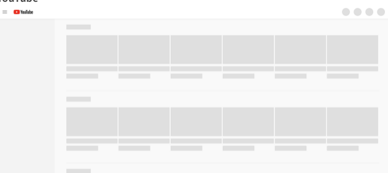

[프론트앤드 웹 성능 가이드 - 성능 지표, 데이터 로드 최적화](/frontend-web-performance-guide-1) 에 이은 글입니다

# 렌더 및 실행 최적화

---

&nbsp; 전편 의 방법으로 무사히 사용자의 실행 환경에 데이터가 로드가 되었다. 우리는 이제 받은 데이터로 화면을 그려내야 한다. 렌더 및 실행 단계에서 성능 향상을 위한 방법은 로드가 화면을 그리는 전반에 거쳐서 모두 존재한다. 어떤 방법으로 사용자에게 성능 향상을 느끼게 하여 사용자 경험을 높일 수 있을까

## FCP 및 TTI 개선 아이디어

&nbsp; 사용자는 눈에 뭐라도 진행 상황이 보여야지 뭔가 진행 되고 있음 을 깨닫고 페이지를 떠나지 않는다. 웹 어플리케이션의 성능을 인지 하는 데 있어서도 구체적인 지표가 아닌 불편함이 없이 충분히 빠른 속도로 동작되는지만 확인하는데 사용 중에 흰 화면이 자주 뜬다면 성능이 안 좋다고 느끼게 된다. 또 뭔가 뜨더라도 동작이 되야 되야한다. 이런 상태까지 걸리는 시간인 TTI 를 개선하기 위해 웹 개발자들은 많은 아이디어들을 내고 있다

- `PRPL` 패턴
  PRPL 패턴은 구체적인 방법 이라기 보다는 `TTI`를 빠르게 하기 위한 `PWA`의 방법론에 가깝다.
  - 중요한 리소스를 미리 로드해라 (`Push` (or preload) the most important resources.)
    - `preload` 선언을 하면 브라우저에게 우선순위를 표현할 수 있다
      ```html
      <link rel="preload" as="style" href="css/style.css" />
      ```
  - 최초 라우팅을 가능한 빠르게 렌더링해라 (`Render` the initial route as soon as possible.)
    - 필수 스크립트는 동기적으로 로드후 실행한후 나머지는 async 하게 실행시키는 방법
  - 나머지 assets을 미리 캐싱해두어라 (`Pre-cache` remaining assets.)
    - `Service Worker` 를 이용하면 된다
  - 기타 다른 라우팅과 덜 중요한 assets을 레이지 로딩 해라. (`Lazy load` other routes and non-critical assets.)
- `App-Shell` 모델
  애플리케이션 셸(또는 앱 셸) 아키텍처는 `Progressive Web App`을 빌드하는 방법 중 하나이다. `Shell` 은 사용자 인터페이스를 구동하는 데 필요한 최소한의 HTML, CSS 및 자바스크립트 의미 한다. 일종의 UI 뼈대 같은 것이다.`Shell`이 `Service Worker`를 이용해 오프라인으로 캐싱되면 사용자는 재 방문시 흰 화면이 아닌 UI의 뼈대를 보게되고 성능 향상을 느끼게 된다. (참고 : [앱 셸 모델](https://developers.google.com/web/fundamentals/architecture/app-shell?hl=ko))
- 스켈레톤 UI
  스켈레톤 UI를 이용하면 `FP` 가 더 빨라져서 사용자가 뭔가 진행 됨을 느껴 성능 향상이 된다. 레이아웃은 먼저 잡아 주기 때문에 로딩 스피너 보다도 조금 더 의미있는 렌더 기 때문에 사용자 경험이 높아진다.
  
- `Progressive Hydration`
  보통 프론트앤드 성능 개선 목표 달성을 위해 CSR 과 SSR 일방적으로 하나만 쓰기보다는 둘 모두의 장점을 이용하기 위해 둘 다 쓰게 된다. (참고 : [Web Rendering](https://www.notion.so/Web-Rendering-3246a7055d124a088fd86e7399ac36e4))

       React에서는 첫 `FCP` 를 빠르게 하기위해서 Next.js 처럼 서버가 첫 렌더를 먼저 그려주고 `hydration`으로 이벤트를 입히는 방법을 흔히 쓰게 된다. 하지만 렌더가 되서 보이긴 하더라도 `hydration` 작업 중에 `TTI`가 늦어져서 사용자는 정작 동작을 못하는 문제가 생길 수 있는데 `Progressive Hydration` 을 이용하면 된다. `Progressive Hydration`은 `InteractionObserver`를 이용해서 보이는 컴포넌트 부터 `Hydration`을 진행하는 방법을 말한다.

- `micro-optimizations` 과 `progressive booting`
  SSR 로 첫 의미있는 화면을 최대한 빨리 그리고 최소한의 JS로 TTI도 빠르게 하는 방법이다. 세부적인 동작들에 필요한 JS 코드들은 `LazyLoad`되고 실행되도록 한다. 실행은 비동기적로 분리적으로 하고 `requestIdleCallback` 필요하다면 이용 될 수 있다. (참고 : [When everything's important, nothing is](https://aerotwist.com/blog/when-everything-is-important-nothing-is/))

## JS 실행 최적화

&nbsp; JS의 무거운 연산들은 싱글 스레드 환경에서 브라우저 렌더를 막기 때문에 `Web Worker`를 이용해서 비동기적으로 계산하도록 한다. JS를 둘러싼 많은 성능 향상 아이디어는 해당 글에서 확인하도록 하자 (참고 : [자바스크립트 비동기 처리 가이드](https://www.stevy.dev/6c7449e2-bafb-4a3c-a3ac-e7f4ffffffc1))

## 레이아웃 변경 전략

&nbsp; 레이아웃이 변경되는 것은 브라우저가 상당한 리소스 비용을 소모하게 만든다. (참고 : [웹 성능 최적화에 필요한 브라우저의 모든 것](https://tv.naver.com/v/4578425) ) UI 업데이트시 브라우저가 레이아웃을 새로 만드는 과정을 피해야 하기 위해 아래와 같은 방법과 주의 사항 들이 있다.

### 강제 동기 레이아웃 피하기 & 레이아웃 스래싱(thrashing) 피하기

&nbsp; `offsetHeight`, `offsetTop`과 같은 계산된 값을 속성으로 읽을 때 브라우저는 강제로 동기 레이아웃을 수행한다 (참고 : [What forces layout / reflow](https://gist.github.com/paulirish/5d52fb081b3570c81e3a))

```jsx
const tabBtn = document.getElementById('tab_btn');

tabBtn.style.fontSize = '24px';
console.log(testBlock.offsetTop);
// offsetTop 호출 직전 브라우저 내부에서는 동기 레이아웃이 발생한다.
tabBtn.style.margin = '10px';
// 레이아웃
```

한 프레임 내에서 강제 동기 레이아웃이 연속적으로 발생하면 성능이 더욱 저하된다

```jsx
// Bad
function resizeAllParagraphs() {
  const box = document.getElementById('box');
  const paragraphs = document.querySelectorAll('.paragraph');

  for (let i = 0; i < paragraphs.length; i += 1) {
    paragraphs[i].style.width = box.offsetWidth + 'px';
    // for문 돌면서 강제 동기 레이아웃 계속 진행
  }
}

// Good - 레이아웃 스래싱을 개선한 코드
function resizeAllParagraphs() {
  const box = document.getElementById('box');
  const paragraphs = document.querySelectorAll('.paragraph');
  const width = box.offsetWidth; // 강제 동기 레이아웃 한번만 진행

  for (let i = 0; i < paragraphs.length; i += 1) {
    paragraphs[i].style.width = width + 'px';
  }
}
```

### 가능한 JS 보다는 CSS 애니메이션을 써라

&nbsp; 브라우저는 CSS애니메이션을 처리하기 위한 성능 최적화가 더 잘 되어있다. 더불어 `transform` 속성 을 이용하면 GPU를 이용한 CSS 애니메이션을 하게되어 JS로 진행되는 애니메이션 실행 보다 훨씬 더 좋은 성능을 보일 수 있다.

### setTimeout 보다 requestAnimationFrame

&nbsp; `rAF`를 이용하면 프레임 시작과 맞춰서 JS를 실행하기 때문에 렌더 프레임에 영향을 주지않고 UI 변경하게 된다. ( 참고 : [자바스크립트 실행 최적화](https://developers.google.com/web/fundamentals/performance/rendering/optimize-javascript-execution))

### 필요하다면 will-change 옵션

&nbsp; `will-change` CSS 속성은 요소에 예상되는 변화의 종류에 관한 힌트를 브라우저에 제공케 한다. 그래서 실제 요소가 변화되기 전에 미리 브라우저는 적절하게 최적화할 수 있다. 이러한 종류의 최적화는 잠재적으로 성능 비용이 큰 작업을 그것이 실제로 요구되기 전에 미리 실행함으로써 페이지의 반응성을 증가시킬 수 있다. `will-change`는 브라우저 리소스를 쓰기 때문에 최적화를 위한 최후의 보루로 남겨두는게 좋다 (참고 : [will-change MDN](https://developer.mozilla.org/ko/docs/Web/CSS/will-change))

### DOM 변화는 최대한 적게

- DocumentFragment 활용해서 몰아 넣은 다음 한번에 붙이는게 유리

  ```jsx
  // Bad
  const app = document.getElementById('app');

  for (let i = 0; i < 1000; i++) {
    const el = document.createElement('div');
    el.innerText = `${i}`;
    app.appendChild(el);
  }

  // Good
  const app = document.getElementById('app');
  const frag = document.createDocumentFragment();

  for (let i = 0; i < 1000; i++) {
    const el = document.createElement('div');
    el.innerText = `${i}`;
    frag.appendChild(el);
  }

  app.appendChild(frag);
  ```

### display:none vs visibility: hidden

&nbsp; css 속성을 `diplay none`으로 하면 레이아웃을 따로 하지않아서 `visibility: hidden` 으로 DOM을 감출 때보다 UI 업데이트시 성능 향상이 있다

### content-visibility: auto

&nbsp; `content-visibility` 속성을 `auto`로 하면 content가 보일 때만 레이아웃 계산을 하게 해서 성능향상을 할 수 있다. 일부 최신 브라우저에서 지원 되고 있다. (참고 : [content-visibility: the new CSS property that boosts your rendering performance](https://wit.nts-corp.com/2020/09/11/6223) , [content-visibility MDN](https://developer.mozilla.org/en-US/docs/Web/CSS/content-visibility) )

### transform 사용

&nbsp; `transform`을 사용한 엘리먼트는 레이어로 분리되기 때문에 영향받는 엘리먼트가 제한되어 레이아웃과 페인트를 줄일 수 있다. `reflow`와 `repaint`를 일으키는 속성들은 [여기](https://csstriggers.com/)서 확인 가능하다

# 마치며

---

&nbsp; 웹 환경은 죄다 얽혀있어서 성능 최적화에도 상당한 내공을 필요로 한다. 성능 문제는 주로 무의식중에 쓰여진 코드나 설정에서 발생 하기 때문에 단순히 글을 읽는 것을 넘어서 성능 개선에 대한 관심과 훈련들이 필요할 것이라 생각이 든다. 참고의 Front-End Performance Checklist 2021 글을 보면 필자가 미처 내공이 부족해서 못담은 부분도 많다. 프론트앤드 웹 성능 개선에 관심 많은 분이라면 해당 글을 더 탐독해 봐도 좋을 것 같다.

### 참고

---

[Front-End Performance Checklist 2021 - Smashing Magazine](https://www.smashingmagazine.com/2021/01/front-end-performance-2021-free-pdf-checklist/?fbclid=IwAR3XT8pes4dchvONMa8fwnZKJYB3tsSfve_Sj2crOGbdxCNGmnCA03BXcro)

[TOAST UI](https://ui.toast.com/fe-guide/ko_PERFORMANCE)

[프론트엔드 Back to the Basics : 지속 가능한 코드작성과 성능 향상법 | 패스트캠퍼스](https://fastcampus.co.kr/dev_red_ktg)
