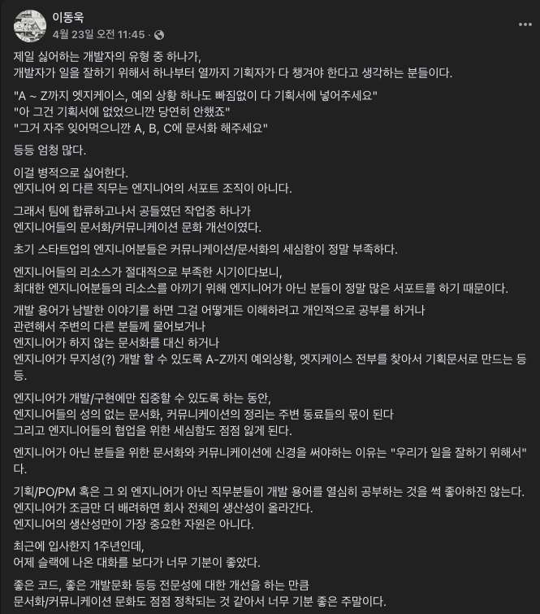

### 책을 읽게 된 계기

&nbsp; 카카오에 온 지도 반년 정도 지났다. 카카오에는 뛰어난 개발자가 많다. 전 회사에서는 조금만 잘해도 우쭈쭈 해주셨지만 여기서 내 개발 능력은 이제 나의 장점이 아니다. 신입이라 해도 모두가 뛰어난 개발자고 본인의 방향에 따라 애플리케이션 개발을 끌고 갈 힘이 있다. 또, 협업이 생각보다 어렵다. 이곳의 조직들은 생각보다 다 규모가 있어서 전 회사보다 애자일(정확히 애자일이 뭔지는 모르겠지만)한 개발이 이뤄지지 않는다. 조직은 크고 일은 다 분업화되어있어서 프로세스를 파악하기 어렵다. 그 가운데 나는 서 있고 협업도 구성원으로서 해결해야 할 중요한 능력 중 하나라고 느낀다. 그런 생각을 하던 중 우연한 기회로 김영한 님의 추천을 보고 함께 자라기라는 책을 보게 되었다. 최근에 가장 페이스북에서 영감을 많이 받고 있던 김창준 님의 책이라서 더 신뢰가 갔고 읽다 보니 너무 좋아서 주변 분들에게 소개해서 함께 독서모임 주제 책으로도 삼아서 읽게 되었다.

### 자라기

&nbsp; 이 책에 인용된 연구 결과에 의하면 커리어를 시작하는 시점에서는 경력과 실력과 상관성이 꽤 높다고 한다. 하지만 그 후 시간이 지날수록 이 상관성은 곤두박질친다. 4년 차 개발자를 앞둔 지금의 나는 점점 경력과 실력의 상관성이 곤두박질 시작할 시점이다. 이 책에서는 의도적 훈련을 소개한다. ( 열정의 배신이라는 책에서도 보고 많이 감명받았던 부분이다. 1만 시간의 법칙에서 소개된 훈련법이라고 한다. ) 사람이 숨쉬기나 걷기를 단순 같은 방법으로 한다고 해서 숨쉬기나 걷기의 고수가 되는 게 아닌 것처럼 단순한 반복 훈련은 그만큼 효과가 없다. 의식적으로 피드백을 받으면서 피드백 받은 내용으로 다시 훈련했을때 훨씬 더 적은 시간으로 빠른 성장이 가능하다는 내용이다. 피드백은 실수를 통해서도 일어나고 선임 개발자의 조언이나 책 등에서 얻을 수 있다. 특히 이런 피드백들이 더 직접적으로 이뤄지기 위해서는 동료와 협력을 통해 강한 자극이 이뤄져야 하는데 코로나로 인한 재택근무로 인해 이런 부분은 약해져서 조금 아쉽긴 하다.

### 함께

&nbsp; 전 회사에서는 일 잘하는 바쁜 기획자님들과 함께 너무 편하게 일했던 것 같다. 원래도 애자일을 강하게 도입하고 있던 회사였고 기획자분이 일종의 애자일 코치가 돼서 경계를 허물고 서로 피드백을 원활하게 하면서 일했었다. 시스템이 워낙 강하게 잘 되어 있어서 큰 고민 없이 일했었다. 하지만 사실 생각보다 많은 회사에서 협업에 어려움을 가지고 프로젝트가 우당 탕탕하면서 진행이 돼가고 있다.

&nbsp; 최근 본 조졸두님의 글이다. IT 회사의 애플리케이션은 개발은 개발자 혼자 하지 않는다. 한국 IT기업 특성상 기획자라는 직군이 존재하고 일정, 이슈관리, 기획서 작성, 협업, 컨택 등 많은 부분을 담당하고 있다. 실력 있는 기획자들은 모든 것을 챙길 수 있겠지만 결국 다 사람이 하는 일이라서 잘짜여진 코드처럼 모든 게 진행되지는 않는 게 일상의 개발이다. 특히나 조직이 너무 크거나 업무 프로세스가 너무 자율적이라서 프로세스가 제대로 안 갖춰진 경우는 이런 경우가 더 빈번하다. 지금 회사에 처음 왔을 때는 무슨 개발자가 이런 것까지 다 해야 하냐 하고 불평불만이 많았다. 그러던 중 점점 그런 환경에 적응을 하면서 개발자가 나서서 기업가 정신을 가지고 한 발 더 앞서서 소통하고 공유하면 프로젝트가 좀 더 원활하게 흘러가는 것을 깨닫기 시작했다. 책에서 나온 것처럼 진행되는 과정에서 나의 논리는 중요하지 않다는 것도 느꼈다. 상대방이 주제에 대해 어디까지 이해하는지 확인하는 게 먼저였고 상대방의 감정을 파악하면서 설명을 지속해야 했다. 그런 과정이 문자로만 진행될 때는 그런 감정 파악이 쉽지 않아 또 다른 어려움도 겪게 되었다. 코로나 시대의 재택 환경에서는 협업을 위한 또 다른 스킬도 요구되는 듯하다.

### 애자일

&nbsp; 애자일은 책을 읽고 난 후에도 어려운 개념이다. 이 책의 *고객에게 매일 가치를 전하라*를 애자일의 비기로 전한다. ‘고객’은 이해관계자들이며 ‘매일’은 지속해서 수행되어야 함을 의미하고 ‘가치’는 해당 프로젝트의 문제 정의를 의미한다. 책에서 고객 참여를 가장 효과적인 애자일 방법 성공의 키로 소개하는데 고객이 단순한 프로젝트의 이해당사자만 의미한 건지 진짜 그 프로젝트의 대상이 되는 고객의 참여를 말하는 건지 아직 이해하지 못했다. IT 서비스의 고객이 프로젝트에 직접 영향을 행사하는 것은 게임에서 게이머들이 간담회를 통해 의견을 전달하는 것 말고는 아직 못 봤다.

### 마치며

&nbsp; 이 책은 나의 개발자로서 혹은 IT 회사에 일하는 일꾼으로서 무엇을 지향해야 하는가를 다시 생각하게 해줬다. 첫 회사에 다녔을 때 나를 뽑았던 선임 개발자분은 단순 개발만 잘하는 개발자보다 본인은 일 잘하는 개발자를 더 선호한다고 하셨다. 책을 읽으면서 그때 그 생각이 나면서 공감이 많이 갔다. 또, 최근 일하면서도 느끼고 있다. 함께 자라기는 개발자뿐만 아니라 협업하는 분야의 사람이라면 계속 곱씹어서 읽어봐야 할 책이었다.
