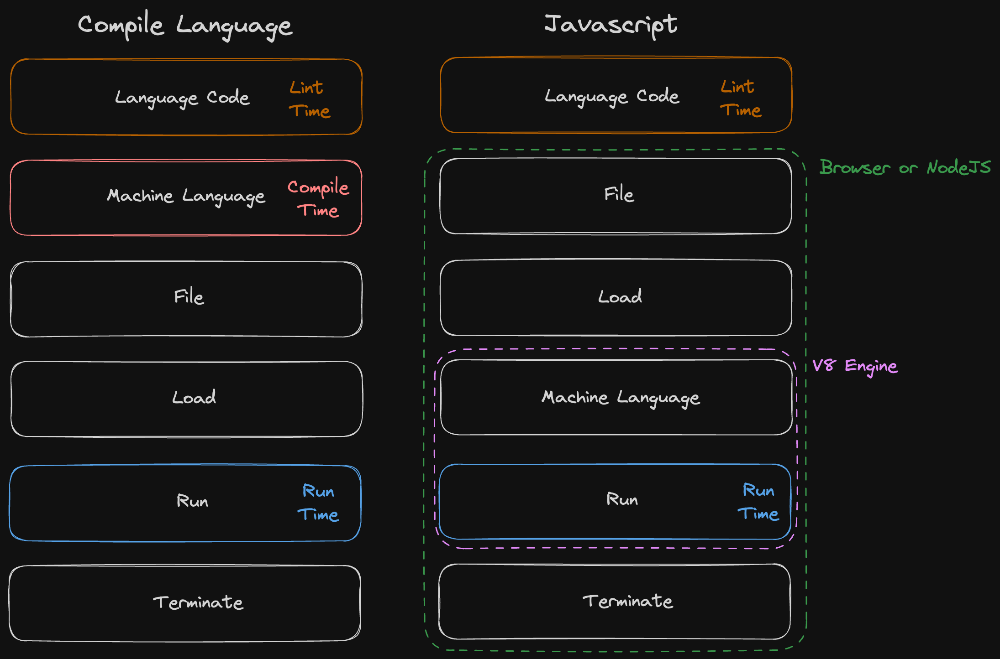

&nbsp; 타입스크립트와 리액트로 개발을 하던 중, 문득 자바스크립트가 어떻게 브라우저의 표준으로 채택되어 이러한 혜택을 받게 되었는지 궁금해졌다. 요즘 나는 코틀린 언어에 관심이 많은데, 코틀린 언어로 프론트엔드 개발이 가능한지도 궁금했다. 코틀린에서도 프론트엔드 개발이 가능하긴 하지만, 결국 자바스크립트로 변환되어 동작하게 된다. 이런 모습을 볼 때마다 브라우저가 인터프리터 언어인 자바스크립트를 직접 해석하기보다는 바이트 코드 등의 저수준 코드를 읽었다면, 다양한 언어로 브라우저 화면 개발이 가능하지 않았을까 하는 의문이 든다. 이 글에서는 자바스크립트의 간단한 역사와 왜 인터프리터 언어로 설계되었는지, 또한 인터프리터 언어이기 때문에 발생하는 문제점들에 대해 탐구해 보았다.

### 자바스크립트의 간단한 역사

&nbsp; 자바스크립트는 인터넷 대중화 초기, 웹 브라우저 점유율 대부분을 차지하던 넷스케이프의 브랜든 아이크가 단 10일 만에 만든 언어다. 자바스크립트 이전에도 HTML, CSS를 넘어서 동적인 페이지를 만들고자 하는 시도가 많았지만, 대부분 특정 플러그인을 요구했기 때문에 사용자 입장에서는 동적인 페이지를 이용하는 것이 상당히 부담스러웠을 것이다. 브랜든 아이크는 자바스크립트를 도입하고 이를 표준으로 삼아 별다른 플러그인 없이도 동적인 브라우저 환경을 제공하고 싶어 했다. 이후 마이크로소프트의 인터넷 익스플로러에서도 자바스크립트 문법이 지원되면서 웹의 표준이 되었고, 지금의 브라우저에서 독점적인 언어의 자리를 차지하게 되었다.

&nbsp; 넷스케이프와 마이크로소프트라는 강력한 뒷배 덕분에 브라우저의 표준 언어로 채택되었지만, 자바스크립트의 길도 그렇게 순탄하지는 않았다. 자바스크립트는 수십 년 동안 브라우저에서 널리 쓰이고 있었지만 너무 짧은 시간에 설계된 언어였고 여러 단점들이 많았다. 추상화가 너무 많이 되어 있어 브라우저가 코드를 읽고 해석해서 동작하는 데까지 너무 큰 성능이 요구되었다. 또한, 타입 시스템은 느슨해서 버그가 나기 쉬웠고, 모듈 시스템도 없었다. 여러 브라우저 버전에 의한 호환성 문제도 있었고, Javascript WTF같은 예제들에서 볼 수 있듯이 결과 예측이 어려운 괴랄한 모습도 많이 보였다. 이런 모습 때문에 자바스크립트는 안티가 많이 생겼고, 동적인 화면을 개발하는 데 있어 자바스크립트는 점점 개발자로부터 멀어져만 갔다. 자바스크립트 대신 어도비의 flash가 많이 선택받게 되었고 애플의 flash를 걷어내기 위한 노력 전까지 자바스크립트는 암흑기를 겪었다. 지금은 많은 선지자들의 노력 끝에 개과천선하여 초기에는 상상도 못 했던 서버부터 우주선의 UI를 조작하는 데까지 널리 쓰이는 언어가 되었다.

### 인터프리터 언어

&nbsp; 자바스크립트는 인터프리터 언어이다. 넷스케이프는 어떤 운영체제든 상관없이 웹 브라우저라면 동작하고, 간단하게 HTML 요소들과 상호작용하는 언어를 원했다. 또한, 브라우저 경쟁 시대였기에 빠른 출시도 필요했다. 인터프리터 언어는 그들의 조건을 만족시켜 주는 선택이었다. 브랜든은 그 요구사항에 맞게 빠른 시간 안에 브라우저에서 쓸 수 있는 언어를 만들었지만, 그도 처음에는 그 언어가 이렇게 인기가 많아지고 독점적 지위를 가지게 될 거라고는 생각하지 못했을 것이다. 그의 생각과는 별개로, 결과적으로 인터프리터 언어로 설계되어 브라우저에서 동작되기 때문에 장점도 단점도 많고, 그 영향은 인터넷 세상 전반에 퍼져 있다. 일단 일반적인 컴파일 언어와 인터프리터 언어인 자바스크립트의 차이를 살펴보자.

- 출처 : 코드스피츠

&nbsp; 일반적으로 프로그램은 사람이 작성할 수 있는 언어 형태의 코드로 먼저 작성된다. 그 후에 컴퓨터가 읽을 수 있는 기계어로 번역되고, 이를 컴퓨터가 읽으면서 실행한다. 이런 일반적인 실행 흐름의 큰 구조는 컴파일 언어와 인터프리터 언어가 동일하다. 차이가 있다면 기계어로 번역되는 시점이다. 컴파일 언어는 프로그래밍 언어로 작성된 코드가 컴파일러를 통해 기계어로 번역되어 파일 형태로 저장되고, 이 파일을 런타임에 실행하면서 동작한다. 반면, 인터프리터 언어는 프로그래밍 언어 자체가 파일로 저장되고, 이 파일을 런타임에 기계어로 바꾸면서 동시에 실행한다. 자바스크립트의 경우, 자바스크립트 언어 파일 자체가 저장되고, 이 파일을 브라우저가 런타임에 기계어로 변환하고 실행하게 된다. 여기서 런타임은 실행하는 순간을 의미한다.

### 인터프리터 언어로 설계되어 생긴 문제들

&nbsp; 자바스크립트 언어 자체를 인터프리터 언어로 설계한 것은 브랜든 아이크가 빠른 프로그래밍 언어 발명의 편의를 위해 내린 선택이었을 수도 있지만, 그 선택으로 인해 웹 생태계 전반에 걸쳐 다양한 결과가 나타났다.

&nbsp; 첫 번째로는 성능 문제를 겪었다. 실행 중에 기계어로 해석되기 때문에 이미 기계어로 번역된 채로 실행되는 컴파일 언어보다 느릴 수밖에 없다. 또한, 타입 검증 역시 런타임에서 발생하기 때문에 이로 인한 오버헤드가 발생한다.

&nbsp; 두 번째로는 자바스크립트 언어가 브라우저 혹은 실행 환경과 직접적인 의존성을 갖는다는 점이다. 컴파일 언어로 개발된 앱의 경우, 컴파일 시점에 이미 실행 가능한 환경이 정해지고 기계어로 번역된다. 따라서 번역 전에 최신 문법으로 개발하든 실행 환경이 전혀 모르는 다른 언어로 개발하든 그것은 어디까지나 개발 환경에서의 컴파일러와 언어 간의 문제이다. 하지만 자바스크립트는 기계어로 번역하는 작업을 브라우저 혹은 실행 환경이 담당하기 때문에 런타임과 직접적인 의존성을 갖는다. 예를 들어, 최신 문법으로 작성된 자바스크립트는 구 버전의 Internet Explorer 환경에서 동작하지 않는다. 런타임인 Internet Explorer는 최신 문법을 인식하지 못하기 때문에 해당 코드를 해석할 수 없다. 사용자가 직접 해당 문법을 해석할 수 있는 신형 브라우저로 변경하여 실행하기 전까지는 해당 코드를 실행할 수 없다. 개발자는 안정적인 앱을 원하고 대부분의 사용자들은 구 버전의 실행 환경을 계속해서 사용하고 있기 때문에, 개발자들은 어쩔 수 없이 구 버전의 브라우저를 지원할 수 있는 구 버전의 자바스크립트를 사용해야 했다.

### 인터프리터 언어의 한계를 넘기 위한 노력들

&nbsp; 위의 문제들에도 불구하고 자바스크립트는 브라우저 환경 개발 언어의 선두 주자로서 계속해서 자리를 유지하고 있는데, 이는 문제를 극복하기 위한 많은 노력들이 있어왔기 때문이다.

&nbsp; 첫 번째로, 성능 문제의 경우 브라우저 엔진의 발전과 함께 다양한 최적화 기법들이 도입되었다. 대표적으로는 JIT(Just-In-Time) 컴파일러나 가비지 컬렉션 최적화 등이 사용되었고, 현대 브라우저에 이르러서는 성능적인 문제가 불편함 없이 해소되었다.

&nbsp; 두 번째로, 브라우저와의 의존성 문제는 여전히 진행 중이다. 사실 프로그램이 실행되는 과정에서 실행 환경 변화에 따른 버그는 항상 존재해왔다. 자바스크립트의 경우 언어가 직접적으로 브라우저와 연결되어 있어서 버전이 맞지 않는 브라우저에서는 실행이 불가능할 뿐이다. 이를 해결하기 위해 최신 버전의 자바스크립트 문법을 원하는 브라우저에 맞게 구 버전의 코드로 변환해주는 트랜스파일링(Transpiling)이 빈번하게 일어나게 되었다. 하지만 지속적인 언어 발전과 함께 구 버전으로 변환하기 어려운 코드나 브라우저 기능들도 많이 생겨나고 있기 때문에 Internet Explorer 같은 오래된 브라우저들은 웹에서 퇴출되기도 하였다.

### 마치며

&nbsp; 처음에 말했다시피, 브라우저 실행 환경에서 이미 컴파일이 완료된 기계어를 실행하는 것이 어땠을까 하는 생각도 들지만, 웹 표준의 철학 하에 확장성 있게 설계되지 않았다면, 통상적인 앱들처럼 OS나 브라우저에 대한 의존성이 더 심화되어 ActiveX 같은 플러그인들로 가득 찬 세계가 되었을 수도 있다는 생각이 든다. 또한, 자바스크립트를 바이트 코드로 컴파일하는 작업을 각 언어마다 하기보다는, 대부분 브라우저가 사용하는 V8 엔진에서 처리하는 것이 비용이나 안정성 측면에서 더 좋아 보인다. 모두가 같은 언어로 브라우저를 개발하기 때문에 여러 브라우저가 같은 엔진을 사용하며 동일한 사이드 이펙트를 일으킬 수 있는 것이다. 머튼 브랜든 아이크가 뿌려둔 자바스크립트 세계는 계속 될 것으로 보인다. 다른 언어로 프론트엔드 개발을 할 수 있다 해도 해당 언어는 메타 언어로서 존재하고 자바스크립트는 개발 환경과 브라우저 사이에서 동작하는 코어 언어로서라도 계속 존재할 것 이다.
