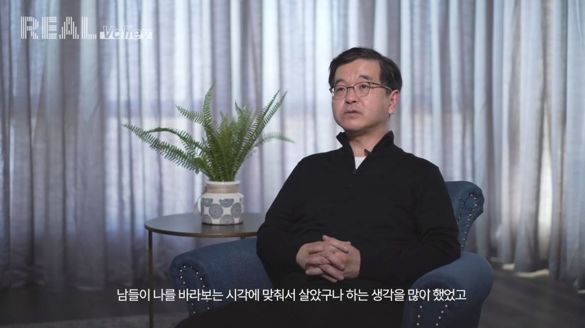
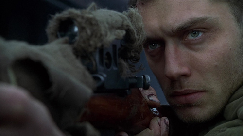
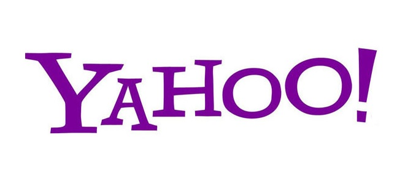

- 출처 : eo스튜디오

## 글을 쓰는 이유

&nbsp; 유튜브 채널 EO에서 진행한 한기용 님 인터뷰를 보고 느낀 바가 많아서 따로 블로그 글로 정리하고 성찰의 기회로 삼아보기로 했다. 해당 인터뷰에서 한기용 님은 흔한 개발 뽕이 넘치는 영상들과 다르게 수십 년간 IT 계에 몸담으면서 느낀 바를 담담하게 이야기해 주셨다. 보통의 개발 관련 영상들은 개발자는 뭔가 특출난 잘난 사람이 해야 하는 직업이고 나는 그런 잘난 사람인데 한 수 가르쳐 줄까 하는 선민의식이 깔린 영상이 대부분이다. 반면, 한기용 님의 조언에는 흔히 생각하는 통념을 부수는 다양한 경험에서 우러난 현자의 인사이트가 깔려있었다. 본인의 상처와 실제 경험들을 하나씩 말해주시면서 답변해 주셨기 때문에 더 공감이 가고 배우고 싶어졌다.

## About Inside

### 어디에 중점을 두고 일할 것인가

&nbsp; 프로젝트를 진행할 때 결과에 포커싱 한 게 아웃풋이 더 좋았다고 한다. 통상의 엔지니어들은 기술에 포커싱 하지만 사실 기술보다는 프로젝트 자체에 집중해야 하고 내가 이것을 왜 하고 있고 무엇이 중요하고 어떻게 최소의 비용으로 결과를 만들어 낼 수 있는지에 중점을 둬야 한다. 기술에 과몰입 하는 것은 한국 개발자들에게 자주 보이는 특징인데 기술 공부를 지속적으로 하고 뒤처지지 않으려고 하는 것은 단순히 본인의 마음을 안정을 위한 경우가 많다. 주니어 때부터 기술 중심으로 성과를 내왔기 때문에 관성적으로 그렇게 한다. 주니어 때 인정받기 위해서는 물론 확실한 스킬 셋이 필요하지만 그 후 시니어 레벨에서는 기술은 기본이고 본인의 영향력이 중요하다.

영향력을 키우기 위해서는 내가 가지고 있는 장점과 단점을 생각해야 하고 내가 도달하고자 하는 레벨에서 요구되는 능력이 어떤 것 인지 파악해야 한다. 예를 들어 능력 있는 완벽주의 시니어 개발자의 경우 코딩도 잘하고 문서화도 잘하고 주변에 도움도 상당히 줄 수 있겠지만 시간과 자원은 한정적이기 때문에 결과적으로 더 큰 영향력을 보여주기 힘들다. 시니어 레벨을 넘기 위해 요구되는 것은 결과를 위해 선택과 집중을 하면서 프로젝트 리딩을 해야 한다. 한 단계 더 나아가려면 이런 결과를 신경을 써야 한다. 중요하지 않은 일은 대충 해도 된다.

또, 적절한 시기에 레벨을 올리고 그에 따른 능력을 맞추기 위해서는 매니저와 계속 소통을 하는 게 좋다. 승진을 하고 싶다고 요구를 하고 뭐가 부족하고 뭐가 좋았는지 계속 체크를 해야 한다. 매니저 관점에서 방향을 맞추고 나를 파악하며 발전을 해야지 핀트가 맞은 상태에서 성장이 가능하다. 혼자서 그냥 열심히 하면 알아주겠지 하면서 노력을 하면 전혀 다른 방향으로 커리어가 꼬일 수가 있다.

&nbsp; 나의 경우는 어디에 중점을 두고 일했을까? 아직 주니어 레벨이기 때문에 단순히 프로젝트에서 내게 주어진 구현 요건들과 그것을 구현하기 위한 기술에만 중점을 두고 일을 해왔던 것 같다. 사실 기술 증진이 단순하고 자료도 많고 공부하기 편하기도 하다. 그리고 지금 나의 수준에서는 최대한 기술적 역량을 키우는 게 중요하다. 한기용 님은 결과에 집중하라고 하셨지만 그게 무슨 의미인지는 당장 결과가 요구되는 시니어 이상의 레벨이 돼서 결과가 요구되는 상황이 닥쳐야 느껴질 것이다. 하지만 미리 준비한다면 다음 스테이지로 가는 것도 더 빨라지고 갑작스럽게 스테이지 업이 되더라도 무엇에 집중할 것인지 판단하고 리딩 할 수 있을 것이다. 최근 히카맹님이 프로페셔널 제품 책임자라는 책을 추천해서 구매해 둔 상태인데 PM도 아닌 개발자인 나한테 필요한 책인지 약간 의문이 들었는데 찬찬히 정독해 봐야겠다는 생각이 든다.

### 행동하라

&nbsp; 한기용 님이 한국 개발자들 대상으로 컨설팅을 나가서 자주 받는 질문이 “요즘 뜨는 기술이 뭔가요”라고 한다. 이런 질문은 미래를 준비하고 먼저 공부해서 미래에도 안정적으로 살고 싶다는 욕구가 반영된 것이다. 대부분의 한국 청년들이 현재가 아닌 미래를 산다. 하지만 미래는 항상 불확실하고 지금 미리 준비한다고 해도 더 나아간 미래에는 다시 사라질 공부들이다. 한기용 님은 미래를 공부하지 말고 당장 행동하라고 조언한다. 당장의 조금 높은 시작점보다 종착점이 더 중요하기 때문에 수능 보듯이 미래를 준비하지 말고 당장 행동하고 나를 먼저 파악하는 게 중요하다. 먼저 겪으면서 내가 잘하는 게 뭔지 못하는 게 뭔지 맞는지 안 맞는지 파악하면서 다음 단계로 나아가야 한다.

&nbsp; 한기용 님도 한때 야후에서 디렉터를 하면서 안정적인 삶에 적응했다. 안정적인 삶에 안주하여 쉽게 행동하지 못하고 많은 기회를 놓치셨다. 동료들이 기회를 잡고 성공할 때마다 상처가 되었고 쓰러져가는 야후를 떠났다. 그 후 작은 스타트업에 갔지만 과거의 관습에 매여있었고 상처가 많았기 때문에 감정적으로 일하다가 새로운 스타트업도 금방 떠났다. 그 후 1년간을 쉬게 된다. 일단 쉬고 나면 확실한 목표가 생길 것 같았지만 그런 건 없었다. 다만, 깨달은 바가 있었는데 눈치를 많이 보고 살았던 본인을 발견했다고 한다. 그 후로 큰 회사는 안 가기로 하셨고 빠르게 움직이면서 큰 임팩트를 낼 수 있는 곳을 원하게 됐다. 상처를 극복하는 법은 상처받았던 것을 계속 시도해 보는 것이라고 한다. 시간이 오래 걸리지만 다시 겪어보고 다시 경험이 쌓여야 치유가 된다. 한기용 님은 쉬면서 성찰을 통해 자신의 상처를 살펴보고 본인의 상처였던 행동하지 못했던 것을 치유받기 위해 계속 행동했다. (물론 실패한 행동들도 많았다.) 최근 마지막으로 일했던 udemy를 관둘 때는 이전과 달랐다고 한다. 팀이 어느 정도 성장했기 때문에 더 이상 본인의 역량이 필요 없다고 생각해서 후임을 마련하고는 받아놓은 주식을 키운다고 생각하고 쿨하게 회사를 떠났다고 한다. 이것저것 행동하면서 해결하는 게 좋다. 11개 회사를 다녔지만 빨리 관둬서 후회한 적은 없고 오래 다닌 것은 다 후회했다고 하신다.

&nbsp; 개인적인 의견으로는 단순히 보면 한기용 님의 말 한 행동이라 함은 기회를 잡고 회사를 떠나는 것만을 의미하는 것 같지만 깊은 본질은 미래가 아닌 현재에 충실하는 삶이다. 현재도 미래도 항상 불확실하기 때문에 안주하지 말고 기민하게 지금 상황을 보면서 행동을 하고 또 행동에 다시 대응을 하는 오늘을 사는 삶을 살아야 한다.

[[후기] 개발자 한기용님 인터뷰를 보고 - About Outside](/max-advice-2) 로 이어집니다
