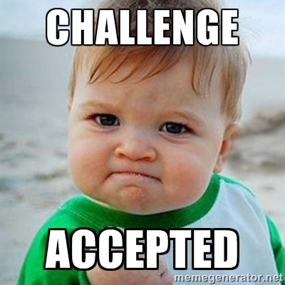
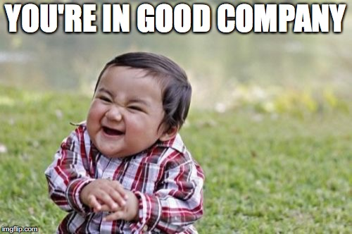

## About Outside

### 안정적인 환경을 뒤로하고 기회를 잡는다는 것

&nbsp; 한기용 님의 지난 후회는 어린 시절 많은 경험을 안 해본 것이라고 한다. 어릴 때는 실패를 해도 회복이 빠르다. 그가 본 미국 청년들은 젊은 시절 많이 헤매고 방황 끝에 방향을 정하고 정한 잣대대로 산다. 단순히 웨이트리스를 해도 자신이 정한 방향이기에 다들 만족하고 산다고 한다.

&nbsp; 한기용 님은 안정적인 환경을 뒤로하고 기회를 잡는 것은 가진 것을 버리는 게 아니라 가진 것과 기회를 바꾸는 것이라고 조언한다. 그는 위에서 말했다시피 야후라는 안정적 환경에 적응한 나머지 많은 기회를 놓쳤었다. 우버, 페이스북 등 많은 기회들이 있었지만 그런 기회를 잡는 것을 가진 것을 버린다고 생각했기 때문에 선뜻 행동할 수가 없었고 커리어 적으로 큰 공백이 생기는 결과가 생겼다. 또, 이런 기회를 잡는 게 다신 돌이킬 수 없을 선택(one way) 같지만 사실 기회에는 돌이킬 수 있는 two way 성격의 선택들도 많다. 능력이 있다면 기회를 잡고 새로운 환경에 가서 별로면 다시 돌아오면 된다. 잘하는 친구가 돌아온다는데마다 할 회사는 없다. 그리고 커리어 결정은 가슴으로 하는 것이다. 모든 기회는 불확실하고 논리로 그런 결정을 내리기는 어렵다. 어느 정도 감정으로 결정을 내려야 한다.

&nbsp; 위 조언들은 지난 회사에 계속 있었으면 공감이 안 갔을 커리어 관련 조언이다. 왜냐면 지난 회사에서는 내가 교환할 안정적인 환경도 없었고 불확실성은 높아가는데 반해 얻을 수 있는 보상도 없었다. 그랬기에 안정적인 환경을 위한 기회를 잡기 위해 노력했고 지금은 그 환경 아래서 만족하며 일을 하고 있다. 만족을 하고 있는 지금의 시점에서 볼 때 도움이 될 수 있는 조언들이다.( 어떻게 보면 배부를 수 있는 고민들.. ) 어떤 기회가 왔을 때 후회를 최소화하고 그 선택을 위해서는 two way 성격의 선택을 해야 한다. 그 성격은 내 능력에 따라 달라지고 내가 지금 얼마나 일에 집중을 하고 인정받느냐에 따라 달라질 것 같다. 결정은 가슴으로 하는 것도 크게 공감한다. 내가 내리는 대부분의 큰 결정들도 꿈에 나올 정도로 감정적이었다.

### 좋은 조직

&nbsp; 한기용 님이 말하는 좋은 기회를 주는 조직은 성장하는 회사다. 망하는 회사는 사람을 소극적으로 만들고 지속된 실패로 자신감을 떨어뜨린다. 그런 환경에서는 정치적인 인간만 만들 뿐이다. 또, 자신을 증명해야 하는 환경에서도 뭔가 주도적으로 일하기 힘들어서 아웃풋을 빨리 내기 힘들다.

&nbsp; 좋은 조직은 좋은 사람을 뽑고 나서 그 사람을 성공으로 이끌기 위해 노력을 한다. 초기 멤버들로는 성장이 어렵기 때문에 특정 시점에 해당 이슈를 해결해 줄 인재가 항상 필요하다. 인재를 뽑고 나서도 그 사람이 회사에서 성공해야 회사의 성장으로 이어지기 때문에 거기에 많은 노력을 기울인다. 성장이 지속되지 않는 조직은 이와 같은 인재를 큰돈을 들여서 뽑아 놓고도 기존 멤버들이 기득권을 유지하려고 해서 갈등이 생기고 해당 인재가 회사에 기여하는 것을 방해한다. 특히 스타트업 초창기의 경우에 창립 멤버들이 키워온 열매들을 새로 들어온 인재들이 많은 부분 차지하게 된다. 이때 창립 멤버들이 열매를 지키기 위해 새로운 인력을 견제하기보다는 조직의 스테이지마다 다른 인재가 필요하다는 것을 이해하고 내가 가진 경험의 제약을 인정해야 한다. 한기용 님도 유데이의 초기 멤버로 들어갔지만 조직이 어느 정도 성장하자 자리를 쉽게 내려놓고 떠났다. 회사가 성장해야 기존에 받아놓은 지분들도 더 클 수 있다는 것을 오랜 경험을 통해서 알았기 때문에 할 수 있던 결정이었다.

&nbsp; 커리어 초기에는 좋은 매니저나 좋은 사수를 만나는 게 중요하다. 위에서 말했다시피 본인을 성공으로 이끌어 줄 수 있는 조직에서 일을 해야 본인도 성장하고 회사도 성장하게 된다. 어떻게 하면 그런 조직을 찾을 수 있을까? 면접의 기회를 잘 활용해 보면 그런 동료들이 있는지 어느 정도 파악이 가능하다. 면접을 할 때 답변만 하기보다 본인도 역질문을 하면서 그 조직이 어떤지 파악해 보면 된다. 팀에서 일 잘하는 사람 특징, 팀에서 고과를 따지는 법, 합류 후 초기 3개월간 본인이 할 일 등 질문해 보면 된다. 커리어 초기에는 회사 네임 밸류를 보지 말고 어떤 사람이 나의 네트워크가 될 것인지 더 크게 고려해야 한다. 이렇게 파악하고 입사를 해도 생각과 다를 수 있는데 이때는 적응하지 말고 그냥 도망가는 것을 추천한다. 나를 바꾸기보다 나에게 적절한 새로운 환경을 찾는 게 더 좋을 때가 많기 때문이다.

&nbsp; 네임 밸류 좋다는 회사에 들어간 지인들의 경우를 보면 생각보다 폐쇄적인 동료들로 인해 실망하는 것을 자주 봤다. 새로 온 분에 대해 배려가 부족하고 서로 경쟁자라고 생각하기 때문에 도움도 적다. 최근 모든 것을 성과 평가를 해버리는 인사 문화도 이런 분위기를 만든다고 생각한다. 생각해 보면 내가 커리어를 시작한 티몬의 경우 불확실성도 크고 보상도 작았지만 한기용 님이 말한 좋은 동료가 있는 곳이었다. 어떤 이슈가 생기면 본인이 야근을 하더라도 함께 해결했었고 티타임을 할 때 기술 공유도 자연스레 일어나는 곳이어서 커리어 초기에 필요한 기술적 성장에 도움을 주었다. 회사는 결국 성장이 둔화되어서 많은 분들이 이직을 하셨지만 그때 만든 인적 네트워크는 어마어마하게 크고 다양한 회사에 퍼져있다. 조직원의 일원으로서 외부 영입으로 성장할 수 있는 좋은 조직 문화를 만드는 데 기여하고 또 인적 네트워크를 쌓아가는 데 있어서도 관심을 쏟아야 한다. 개인의 성장을 위해서 좋은 조직을 찾는 것도 마찬가지이다.

## 마무리

&nbsp; 한기용 님의 조언들은 그동안 내가 가지고 있었던 많은 생각의 틀을 깨는 조언들이었다. 업무를 다루는데 기술 중심적이었던 점, 나도 모르게 안주라는 길목에 서려고 했던 점, 매니저를 대하는데 소극적이었던 점, 오늘이 아닌 미래에 관심을 쏟던 점 등 많은 부분에 있어서 시니어로 나아가는데 큰 도움을 주는 조언들이다. 단순히 조언을 정리하는데 그치지 않고 해당 내용들을 행동과 커리어로 경험하며 적용해야 한다.
