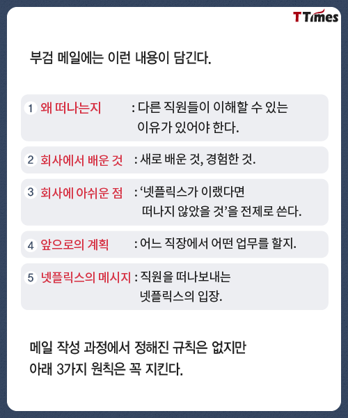

&nbsp; 최근에 지금은 인프런에 계시는 조졸두님이 우아한 형제들을 떠나면서 쓰게된 우아한 형제들 부검글이 인상적이였다. 넷플릭스에서 퇴사할 때 쓰는 부검 메일을 따라쓴 글이었는데,

&nbsp; 첫 직장을 떠나면서 느끼는 개인적인 소회를 천천히 풀어 볼까 한다.

## 왜 떠나는지

### 내가 계획하는 나의 커리어와의 갭

&nbsp; 나는 티몬에서 19년 7월부터 인턴으로 프론트앤드 개발을 시작했다. 학부때는 게임 개발을 해보겠다며 웹 쪽에는 크게 관심이 없었는데 하다보니 웹에 재미를 붙이고 재미를 붙이자 마자 일을 시작해서 웹 전반 지식이 부족 했었다.

&nbsp; 2년차 까지는 웹 전반 지식을 습득하기로 하고 공부를 해왔고 이제 3년차에 들어와서는 좀더 스텝 업을 하기위해서 다양한 환경에서 개발하는 것을 생각하고 있다.

### 이 회사에서 더 성장 할 수 있을까 하는 의문

&nbsp; 티몬은 10년차에 접어드는 서비스이다. 서비스 아키텍쳐와 개발 프로세스가 확실히 잡혀 있어서 로컬 개발부터 배포까지 문제없이 진행이 된다. 문제가 없다는 건 회사 차원에서는 더할 나위 없이 좋은 점이지만 성장해야 하는 응애 개발자에게는 문제다. 프론트 개발을 하면서도 프론트 배포 환경 권한 같은것도 이미 다른 팀에 있기 때문에 쉽게 손볼 수가 없기도 하다. 서버 사이드 렌더링 서버도 따로 없어서 노드를 이용한 서버 사이드 렌더링은 테스트도 하지 못한다. 이런 상황에서 나는 더 배우고 성장 할 수 있을까 하는 의문이 들었다.

&nbsp; 내가 할 수 있는 부분이지 않았나하는 생각도 든다. 직접 건의해서 팀간 서로 업무 조율을 하고 배포 환경 권한도 가지고 오고 서버도 만들어 달라고 해서 따로 테스트도 하고.. (할 수 있었을까?) 도망치듯 회사를 나온다.

&nbsp; 변명이지만 아직 경력이 짧은 내가 경험하지 못한 부분에 대한 두려움이 있었을 것이다. 그냥 개발하면 되지 뭐가 두려운데 라고 생각해보면 주도적으로 기술 자문을 해주시는 리드해주실 시니어가 없는 게 문제기도 하다. 응애 개발자는 두려움이 많다. (두번 다시 도망치지 않으리..)

### 그래서 왜 떠나냐

&nbsp; 위에서 쓴 것과 같이 다양한 환경에서 개발하며 성장하는 것이 어려운듯해서 떠나기로 마음은 먹었다.

## 회사에서 배운 것

### 개발자로서 기본적인 소양

&nbsp; 티몬에 인턴으로 막 들어 왔을때는 웹개발과 프론트 개발을 시작한지 3개월 즈음 됐을때 였다. 2달간 인턴을 하면서 회사가 제공해주는 프로젝트 과제를 수행하였다. 서버 개발자와는 처음 일해보는 것이였고 모든게 낯설어서 새벽부터 일어나서 기술 습득과 과제 수행을 반복했던 기억이 난다. 지금 생각해봐도 당시에는 티몬으로 가는게 베스트였는데 잘 이뤄져서 지금까지 온 것 같다. 좋은 동료 분들이 많아서 함께 많이 배울 수 있었다.

&nbsp; 회사에서 안정적인 프로세스로 서비스 개발 경험을 할 수 있었고 기획자, 디자이너, 서버개발자 등과 같이 협업을 진행하면서 IT회사에서 일하는 프로세스도 배웠다.

&nbsp; 또 업무도 그렇게 많지 않아서 비는 시간동안 웹 개발자로서 꼭 알아야하는 개념 공부도 많이 할수 있어서 좋았다. 배운 개념들은 동료들에게 공유해서 계속해서 피드백을 받았기 때문에 팀적인 기술 발전 기여도 해볼 수 있었다.

### 개발자같이 생각하기

&nbsp; 인턴에서 정규직으로 전환되고 처음 자리를 배정 받은 곳이 개발 괴수들이 우글거리는 티몬의 데브옵스 님들 옆 자리였다. 한번은 버그가 터져서 야근을 하고 있었는데 event.preventDefault() 가 이벤트 핸들러 맨 아래에 있어서 생기는 버그였다. 아무 생각없이 비슷한 작업의 레거시를 복붙해서 작업하고 있다가 생긴 문제 였었다. 헤메고 있는데 데브옵스 한분이 이것저것 의문을 던지기 시작하셨고 이거는 왜 여기 있어요 또 이거는 왜 여기 있어요 찾다보니 찾아 내게 되었다. ( _개발자는 이미 있는 레거시 코드라도 의심하고 또 의심해 하는구나! - 응애 개발자 스티비)_

&nbsp; 또 사소한 개발도 많이 생각하고 많이 노력해서 개발하는 것도 배웠다. 아침 마다 자리가 겹치다보니 어쩔수 없이 데브 옵스 분들 아침 회의를 강제 참석 하게 되었는데 그때마다 느끼는 점은 정말 다양하게 고민하고 깊게 개발 하시는걸 느낄수 있었다. 개발한 부분 자랑은 덤 이기도 했다. _많이 생각하고 많이 노력하자_ 는 개발자 좌우명이 되서 키보드 손목 받침대에 새겨져있다.

&nbsp; 마지막으로 배운 점은 개발자는 문제를 정의하는 사람이라는 것이다. 인턴 처음 시작할때 CTO님이 해주신 이야기 였는데 아직도 기억에 남는다. 우리가 상용 서비스에서 만나는 문제들은 보통 정의가 되지 않은채로 개발자에게 해결을 요구하게 된다. 이때 얼마나 문제를 정확하게 정의하느냐 에 따라서 해결 여부가 갈리게 되고 또 그런 능력의 유무에 따라서 개발자의 value도 달라지게 된다. 사실 아직 그렇게 까지 어려운 문제를 만나본 적은 없는데 점차 시니어로 성장하는 과정에서 계속 새기고 있어야 될 말 같아서 마음 속으로는 새기고 있다.

### 좋은 동료들은 소중하고 집나간 개발자는 돌아오지 않는다

&nbsp; 티몬을 처음 들어왔을 때보다 개발자 수가 절반은 사라진 것 같다. 들어왔을 당시만해도 개발문화가 좋아서 개발자 분들에게 평이 좋은 회사였지만 어느 순간 다 떠나고 없다. 최근 개발자 영입 경쟁이 아주 심하다. 이런 상황 속에서 개발자 생태계를 모르는 대표의 영입은 조금 치명적이였다. 회사의 변한 기조에 실망한 많은 개발자 분들이 네카라쿠배 급 회사들로 이직을 하셨고 그동안 싼 값에 네카라쿠배 급 개발자를 쓰던 회사는 그정도 급 개발자를 다시 뽑기는 어려워졌다. 최근 다시 영입에 힘쓰는 듯 하지만 자본으로 영입을 밀어붙이는 회사들과의 경쟁 속에서 얼마나 다시 좋은 개발자를 영입해서 세울수 있을지는 의문이다. 다시 이전 수준으로 세우고자 하면 아마 그전 보다 훨씬 더 많은 지출이 이뤄져야 할 것이다. 단 1, 2 년의 잘못된 판단으로 조직은 쉽게 무너질 수 있다. _조직을 세우는건 한 세월이지만 무너지는건 순간이구나_

## 회사에서 아쉬운 점

### 짰다

&nbsp; 한국 문화에서 임금을 이야기하는건 조금 부끄러운 일 일수도 있겠다. 하지만 결국 실력으로 평가받는 전문직이나 기술직들 같은 경우 임금은 곧 자기의 실력을 나타내는 경우가 많다. 프로페셔널의 관점으로 봤을때 축구선수도 높은 연봉자나 높은 이적료를 받는 선수가 높게 평가된다. 내가 하는 수준의 일보다 적게 임금을 받는다는 건 나의 Pride와 관련된 문제다. 실력에 맞는 임금은 개발자가 해당 회사에서 근속연수를 길게 가져가는데도 필수적 이라서 회사입장에서도 나쁠게 없는 장사기도 하다. 적은 임금을 주며 잦은 인원교체를 반복하다보면 회사 내 기술이 전수가 덜 될 것이고 이에 대한 피해는 고스란히 회사가 지게된다. 티몬은 처음 왔을때 조금 짠 편이었지만 개발자 영입 경쟁이 치열해진 요즘 기준으로는 많이 짜져 버렸다.

### 좋은 동료 충원이 필요했다

&nbsp; 개발자 영입 전쟁 시점에서 조금 더 공격적인 인재채용이 필요하지 않을까. 티몬에 고졸에 경력이 짧은 괜찮은 개발자를 추천 해본적이 있는데 회사에서 내부자 추천 임에도 서류 탈락 시키는 경우를 보고 좌절했다. 프로그래머스나 그런곳에서 하는 행사에 티몬 이름이 없는걸 보고 회사는 개발자 충원이 급하지 않구나 생각도 들지만 지금처럼 유지 보수만 하는 걸 넘어서 새로운 서비스를 하고자한다면 좋은 동료 영입은 필수적이다 라고 생각한다.

### 그 좋은 동료들로 해볼수 있는 좋은 새로운 서비스들이 필요했다

&nbsp; 이직을 준비하는 중에도 티몬에서 새로운 서비스를 할 기회가 많이 없어서 경력 기술서에도 많은 내용을 담기 어려웠다. 새로운 서비스 개발이 어렵다는건 성장하는 개발자가 커리어를 쌓는데 있어서 언더밸류 될 수 있는 악조건이다. 회사의 기조가 기존 서비스 유지 보수라면 어쩔 수 없겠지만 개발자 스스로에게는 아쉽다.

## 회사를 떠나며

&nbsp; 정말 좋은 분들을 많이 만났고 많이 배웠고 신입 개발자로서 최상의 스타트를 할 수 있는 회사였다. 인턴을 함께 하며 보내온 동기들에게도 감사하고 항상 자기 일처럼 기술 피드백을 해주신 동료들에게도 감사하다.

## 앞으로의 계획

&nbsp; 아직도 모르는게 너무 많은 개발자지만 좀 더 깊게 실력을 높이는 방법에 대해 생각하는 요즘이다. 막 시작 할 때는 배울 게 산더미라서 자바스크립트, 리액트 등 기술을 배우는데 급급 했는데 어느정도 기술을 습득한 지금에서는 다른 고민들이 생긴다. 나는 결국 그 기술들도 구현 할 수 있는 개발자로 성장해야 되기 때문에 새로운 성장을 위한 방향성이 필요하다. 새로운 회사의 환경에 적응하면서 한 차원 높일 수 있는 뭔가를 느끼고 발전 시킬 수 있는 방향을 찾을 수 있으면 더 할 나위 없이 좋겠다. 다양한 환경에서 개발하면서 코드를 맛깔나게 짜는 숙련도를 높이는게 목표기 때문에 자세를 잡고 코드를 많이 짜볼 계획이다.
