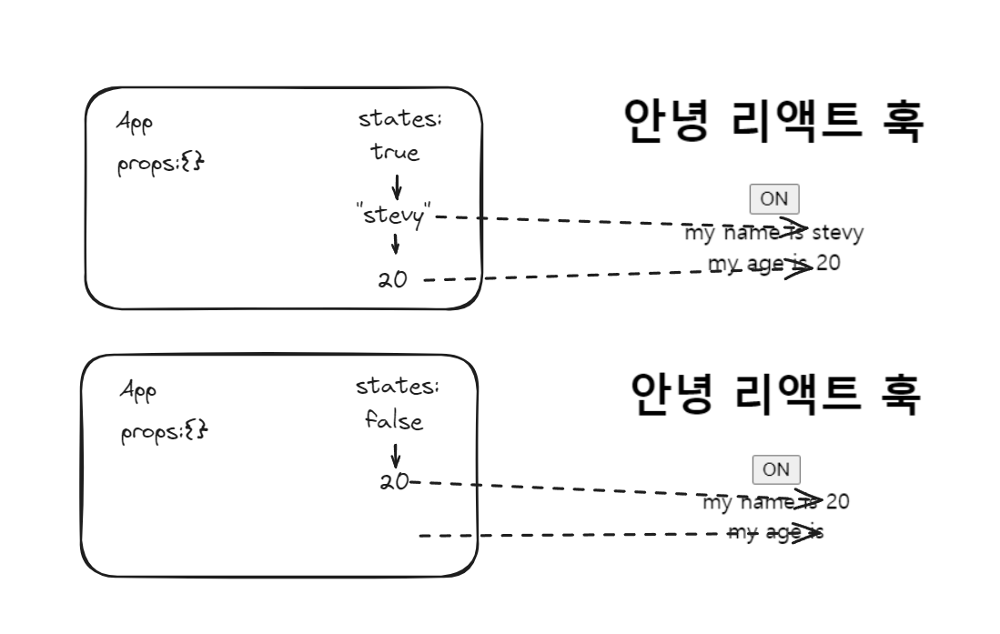

상태에 따라서 조건 부로 React Hook을 실행 시키고 싶었던 적이 있었을 것이다. 이런 경우 기대보다 적은 hooks를 실행 시켰다는 에러를 만나게 된다.


조건부로 hooks 를 사용할 수 없다는 단순한 규칙이지만 여러가지 상황을 만날 수 있다.

### 특정 내장 Hook이 안 쓰이는 Custom Hook은 조건부로 사용이 가능하다.

```jsx
import { useEffect, useState, useLayoutEffect } from "react";

const useEmptyHook = () => {
  console.log("useEmptyHook");
};  

const useCustomHookWithUseEffect = () => {
  useEffect(() => {
    console.log("useCustomHookWithUseEffect");
  }, []);
};

const useCustomHookWithUseState = () => {
  const [value, setValue] = useState(0);
};

const useCustomHookWithUseLayoutEffect = () => {
  useLayoutEffect(() => {
    console.log("useCustomHookWithUseLayoutEffect");
  }, []);
}; 

export default function App() {
  const [on, setOn] = useState(true);
  const toggle = () => setOn(!on);

  if (on) {
    useEmptyHook(); // 가능
    useCustomHookWithUseEffect(); // 불가능
    useCustomHookWithUseState(); // 불가능
    useCustomHookWithUseLayoutEffect(); // 불가능
  }

  return (
    <div className="App">
      <h1>안녕 리액트 훅</h1>
      <button onClick={toggle}>{on ? "ON" : "OFF"}</button>
    </div>
  );
}

```

예제 코드를 실행해 보면 useState, useEffect, useLayoutEffect 를 안 쓴 단순히 "use" prefix로 시작하는 Custom Hook은 문제 없이 동작하는 것을 볼 수 있다.


### useContext는 조건부로 사용이 가능하다

```jsx

import "./styles.css";
import { useState, createContext } from "react";
import { useContext } from "react";

export const AppContext = createContext();

const Test = ({ on }) => {
  if (on) {
    console.log(useContext(AppContext));
  }
};

export default function App() {
  const [on, setOn] = useState(true);
  const toggle = () => setOn(!on);

  return (
    <AppContext.Provider value={on}>
      <div className="App">
        <h1>안녕 리액트 훅</h1>
        <button onClick={toggle}>{on ? "ON" : "OFF"}</button>
      </div>
      <Test on={on} />
    </AppContext.Provider>
  );
}
```


### 왜 이런 규칙이 생겼을까

React는 Fiber로 불리우는 가상의 DOM 노드들이 합쳐진 연결 리스트를 가지고 화면을 그린다. React Hook은 단순히 함수이기에 함수를 조건적으로 실행해서 사이드 이펙트를 만드는 것도 가능하다고 생각하겠지만 특정 내장 Hook 들을 사용한 경우는 어렵다.

useState나 useEffect같은 내장 Hook들은 실행되면 Fiber안에 이 Hook들이 생성한 값들과 순서로서 존재하게 되고 초기 생성 이후 리렌더가 요청되면 해당 Hook들의 결과를 재생성 하는 것이 아니라 이미 생성된 Fiber안의 useState, useEffect의 결과물들만 바꿔서 그리게 된다. 

>
> 
> 
> 위 예제처럼 setState가 호출되어 컴포넌트가 재호출 되어도 내부에서 useState가 다시 실행 되어 초기 값으로 돌아가는 것이 아니라 변경된 값으로 잘 그려지는 것을 많이 보았을 것이다
> 

 이런 구조 아래서 React Hook을 조건부로 실행하게 된다면 해당 컴포넌트가 만들어 놓은 Fibers 내부의 데이터 구조가 망가지게 되고 더이상 정상적인 렌더가 어렵게 된다.

```jsx

import { useState } from "react";

export default function App() {
  const [on, setOn] = useState(true);
  const toggle = () => setOn(!on);
  const [name] = on ? useState("stevy") : [];
  const [age] = useState(20);

  return (
    <div className="App">
      <h1>안녕 리액트 훅</h1>
      <button onClick={toggle}>{on ? "ON" : "OFF"}</button>
      <div>my name is {name}</div>
      <div>my age is {age}</div>
    </div>
  );
}

```



일반적으로 에러로 인해 해당 상황의 재현은 어렵지만 가상의 예제를 들면 위와 같은 형태가 될 것이다. Fiber 구조에서 useState가 생성한 값들의 존재는 항상 보장되어 있기 때문에 컴포넌트의 재호출시 해당 useState를 첫번째 호출과 달리 호출하지 않으면 hooks들로 Fiber 내부에 생성한 상태 리스트가 꼬이게 된다.

useContext의 경우는 어떻게 조건적으로 쓸수 있는 것일까? useContext의 경우는 전역 상태이기 때문에 Fiber 내부에서 순서 의존적인 형태로 존재하지 않는다. 그렇기 때문에 조건적으로 사용되도 Fiber내부의 데이터 구조에 영향을 끼치지 않는다.

### 참고

[You Can’t Use Hooks Conditionally… or Can You?](https://portal.gitnation.org/contents/you-cant-use-hooks-conditionally-or-can-you)
