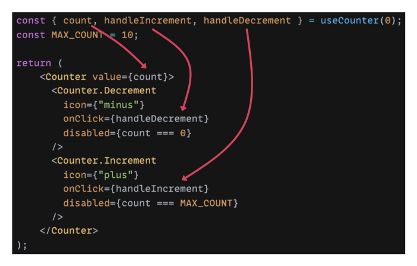

## 나는 어떻게 리액트 설계를 시작했나

---

&nbsp; 리액트를 배울 당시는 빠르게 배우기 위해서 각종 서적과 강의에서 보여주는 구조대로 설계를 했었다. 일단 자바스크립트에 대한 깊은 이해가 없었기 때문에 리액트 자체가 마법처럼 여겨 졌고 서적과 강의에서 알려 준 대로만 설계 했었다. 서적과 강의를 만든 분들도 리액트 공식 문서를 보고 컨벤션을 얻어서 학습 자료를 만들었기 때문에 꽤 나쁘지 않는 설계였다고 생각은 한다. 리액트 공식 문서도 딱히 설계를 명확하게 강요하지는 않고 좋은 코드 형태에 대한 제안만 하고 있다. 하지만 실무에서의 환경은 훨씬 거칠고 거대하기 때문에 고민 없이 배운 설계대로만 하다가는 어느순간 코드가 비대화되고 복잡도가 심화되어서 수정 시마다 사이드 이펙트가 심하게 생기는 관리 할 수 없는 코드가 된다.

&nbsp; 리액트는 DOM 라이프 사이클과 같은 복잡하고 사이드 이펙트가 쉽게 나는 로직들을 리액트 내부로 가져가서 개발자가 사이드 이펙트 걱정없이 뷰 모델만으로 선언형 개발을 할 수 있게 해준다. 우리는 리액트 안에서 구조적인 자유를 얻으면서 더 다양한 시도를 할 수 있다. 설계는 개발자의 취향과 기준에 의한 것이며 절대적인 설계는 없다. 어떤 원칙대로 리액트를 설계할 수 있는지 또 구체적으로 어떻게 설계 되고 있는지 알아보자

## 리액트를 잘 설계하는 것에 대한 고민을 해야하는 이유

---

&nbsp; 우리는 보통 큰 고민을 잘 안하고 리액트를 만진다. 리액트는 복잡한 DOM 업데이트 로직으로 부터 쉽고 빠르게 재사용 가능한 컴포넌트를 쓰게 해줬다. 하지만 여전히 어플리케이션을 어떻게 변화하게 할지 고민 하는 건 개발자의 몫이다.

&nbsp; 우리는 어플리케이션의 변화를 항상 염두에 둬야되지만 우리는 종종 까먹는다. 어플리케이션의 라이프 사이클 동안 무수한 코드 수정과 무수한 개발자들의 손을 거쳐서 어플리케이션이 점점 비대화 된다. 처음에 명확한 설계 원칙을 세워 두지 않고 시작한다면 점차 프로젝트가 커질수록 의존성이 짙고 목적이 사라진 코드가 덕지덕지 작성된다. 결과적으로 누구도 손댈수 없는 코드가 되고 해당 프로젝트는 생각보다 이른 장례식을 치루게 된다.

## 리액트 설계를 하는 원칙

---

### 요약

- 우리는 `확장성`있고 `재사용성` 있는 코드를 만들어야 한다
- `관심사`에 따라서 코드를 `분리`하고 `단일 책임`을 가지는 컴포넌트를 만들어야 한다
- 외부에 `제어를 위임`시키는 것을 고려 해야한다

### 컴포넌트

&nbsp; 우리는 이제 리액트가 제공하는 자유로움 아래서 리액트 프로젝트를 잘 설계하는 원칙을 세워야 한다. 리액트를 잘 설계하기 위해서는 우선 컴포넌트에 대한 이해가 필요하다.

> 컴포넌트는 컴퓨터 소프트웨어에 있어서, 다시 사용할 수 있는 범용성을 위해 개발된 소프트웨어 구성 요소를 일컫는다. - wikipedia

&nbsp; 리액트는 무수한 컴포넌트로 이뤄져 있다. 컴포넌트를 잘 설계하는 것이 리액트 프로젝트를 잘 설계하는 부분에 큰 비중을 차지한다. 사전적 정의에 따르면 컴포넌트는 `재사용성`과 `범용성`을 위해서 만들어져야 한다. 위에서 말한 의존성이 짙고 목적성이 사라진 코드의 문제는 컴포넌트의 특징을 무시한 채 `재사용성`과 `범용성`이 부족한 채 작업 되었기 때문이라고 생각한다. 우리는 작업 일정이나 귀찮음, 혹은 능력부족으로 인해 그때 그때 일이 생길때마다 코드의 line만 보고 여기 들어가면 무슨 동작이 되겠네 하고 작업을 하기 일쑤다. 그렇게 되면 컴포넌트는 `재사용성`과 `범용성`이 떨어진채로 여러 기능이 섞인 처치 불가 코드가 된다. 처치 불가 코드를 어떻게 살릴 수 있을지 또 어떻게 지양 할수 있을지 생각해보자

### `관심사`를 분리하고 `단일책임`으로 설계하기

&nbsp; 컴포넌트가 `재사용성`과 `범용성`을 가지기 위해서는 관심사에 따라 딱 한가지의 역할만 수행시키기를 권장한다. (이를 객체지향에서는 `단일 책임 원칙`이라고 한다.) 리액트 컴포넌트는 단순하게 보면 props를 받아서 DOM 렌더를 시키는 JSX를 리턴하는 함수이다. 프로그래밍에 `순수함수`라는 개념이 있다.

> 컴퓨터 프로그래밍에서 순수함수는 다음을 따른다

- 동일한 인자에는 항상 같은 값을 리턴한다.
- 사이드 이펙트를 내지 않는다

&nbsp; 리액트 컴포넌트를 딱 한가지 역할만 수행시키기 위해 설계 하기 위해서는 `순수함수`의 특성과 같이 동일한 props를 받으면 같은 JSX 리턴하는 `순수함수`로 이뤄져야 한다.

&nbsp; 예를들어 이미지를 받아서 유저 프로필 이미지를 그리는 컴포넌트가 있다고 하자. 이미지를 받아서 그릴 뿐 만 아니라 이미지가 없을때 랜덤 이미지까지 생성하는 컴포넌트라면 단일 책임 원칙을 깬다. 랜덤 이미지 생성은 컴포넌트의 본래 역할과 다른 비즈니스 로직이므로 해당 컴포넌트와 분리되어 개발 되어야 한다. hooks를 이용하면 좀 더 편하게 비즈니스 로직을 외부로 분리 시킬 수 있다.

&nbsp; 잘 `격리`하고 `역할`을 잘 정의해서 컴포넌트를 만들면 코드가 너무 광범위한 역할을 수행하고 복잡해지는 걸 방지해 준다. `단일 책임`을 가지는 순수 컴포넌트들은 테스트하기 좋고 가독성도 좋다.

### 제어 위임

&nbsp; `제어`를 외부에 `위임` 할수록 컴포넌트의 `유연성`과 `재사용성`이 높아진다. 흔히 쓰는 부트스트랩이나 antd를 생각해보자. 필요한 props만 받아서 설정대로 움직이고 제어까지 setState를 받아서 해당 컴포넌트 제어가 가능하다. 핵심 로직은 해당 컴포넌트를 import한 컴포넌트에 의해서 제어가 된다. 마찬가지로 우리가 만드는 컴포넌트도 제어를 위임에 맡길수록 비지니스 로직을 맡는 컴포넌트에 import 해서 재사용이 가능해진다. 재사용이 가능한 부분들은 따로 다 빼서 컴포넌트로 만들거나 hooks로직에 담으면 더 좋은 컴포넌트를 만들 수 있다. 반면, 제어를 `위임`하면 할수록 위임한 코드를 사용 하는 `코드에 대한 이해 난이도`가 높아 가고, `가독성`이 떨어진다는 문제도 있다. `위임`과 `사용 용이성`의 중심을 잘 잡는게 중요하다.

&nbsp; 이어서는 좀 더 구체적으로 리액트 프로젝트 구조 설계 패턴과 컴포넌트 설계 패턴의 예를 소개하겠다. 더 자세하게 알고 싶다면 참고의 링크에서 보면 된다.

## 프로젝트 구조 설계 패턴

---

&nbsp; 프로젝트 구조 설계에 대한 고민은 리액트 프로젝트의 시발점으로 어플리케이션 전반의 주춧돌이다. 다양한 관심사에 따라 나눌 수 있다. 리액트 공식문서는 옳은 방법은 없으며 크게 고민하지 말라고 한다. 자주 함께 변경 되는 파일 끼리 묶는걸 추천한다. 여러가지 패턴을 소개하겠다.

### 파일의 기능이나 라우트에 따라서 분류하기

- 기능이나 경로로 폴더를 나누고 필요한 Js, Css, Test코드 모은다

```
common /
    Avatar.js;
    Avatar.css;
    APIUtils.js;
    APIUtils.test.js;
feed /
    index.js;
    Feed.js;
    Feed.css;
    FeedStory.js;
    FeedStory.test.js;
    FeedAPI.js;
profile /
    index.js;
    Profile.js;
    ProfileHeader.js;
    ProfileHeader.css;
    ProfileAPI.js;
```

### 파일 유형에 따라 분리

- 더 나아가면 아토믹 디자인

```
api /
    APIUtils.js;
    APIUtils.test.js;
    ProfileAPI.js;
    UserAPI.js;
components /
    Avatar.js;
    Avatar.css;
    Feed.js;
    Feed.css;
    FeedStory.js;
    FeedStory.test.js;
    Profile.js;
    ProfileHeader.js;
    ProfileHeader.css;
```

### 아토믹 디자인

<div class="img-wrap">
  
</div>

- 페이지를 나눌 수 없을때 까지 쪼개서 재사용성을 극대화 한다


- 내용물( 비즈니스 로직 )과 껍데기( UI 컴포넌트 )를 분리하고 상태주입을 위한 컴포넌트를 이용해서 주입한다.

### 여러가지 에 의해서 분리한 예

- 도메인 의존성, 기능, 재사용성, 비즈니스 로직 모두 고려해서 나눈 예
  ```
  -src /
    ---domain / // 특정 도메인에 의존적인 컴포넌트
    -----User /
    -------Profile /
    -------Avatar /
    -----Message /
    -------MessageItem /
    -------MessageList /
    -----Payment /
    -------PaymentForm /
    -------PaymentWizard /
    -------services /
    ---------Currency /
    -----------index.js;
  -----------test.js;
  -----Error /
    -------ErrorMessage /
    -------ErrorBoundary /
    -------utils / // Error에서만 쓰이는 유틸은 따로 둘 수도 있다
    ---------ErrorTracking /
    -----------index.js;
  -----------test.js;
  ---components / // 재사용이 가능한 컴포넌트들
    -----App /
    -----List /
    -----Input /
    -----Button /
    -----Checkbox /
    ---hooks /
    ---context /
    ---utils /
    -----Format /
    -------Date /
    ---------index.js;
  ---------test.js;
  ```
- 관심사에 따른 역할에 따라 나눈 예
  ```
  |── src
  │   ├── application // 상태관리, 유틸, 상수
  │   │   ├── common
  │   │   ├── filters
  │   │   ├── logger
  │   │   ├── models
  │   │   ├── persist
  │   │   ├── plugins
  │   │   ├── store
  │   ├── infrastructure // axios, api handeler, 공통 컴포넌트
  │   │   ├── api(services)
  │   │   ├── components (common components)
  │   ├── presentation // 비즈니스 로직 컴포넌트
  │   │   ├── container
  │   │   ├── component
  ├── index.js
  ```

리액트 공식 문서의 권고와 같이 정해진 프로젝트 구조 설계는 없으며 위의 예제를 참고해서 원칙에 따라 설계해보면 좋겠다.

## 컴포넌트 설계 패턴

---

&nbsp; 컴포넌트를 `역할과 관심사에 따라 분리` 시키기 위해서는 코드 내부의 `로직을 쪼개고` 다른 코드로 `위임`을 해야된다. 제어를 위임하는 것의 문제는 쪼개고 위임 할수록 사용 코드에 대한 이해 난이도가 높아 가고, 가독성이 떨어진다 또, 커스텀 설정이 요구되는 경우가 많다. 이 역시 절대적인 것은 없고 개발자의 재량에 따라 최적을 찾아야 한다.

[5 Advanced React Patterns - Alexis Regnaud](https://javascript.plainenglish.io/5-advanced-react-patterns-a6b7624267a6) 가 쓴 5가지 리액트 위임 패턴을 소개한다.


### 합성 컴포넌트 패턴

- 이 패턴은 Prop Drilling 문제의 해결책이 될 수 있다
- 컴포넌트를 더 커스터마이징하고 싶고 좀 더 가독성 좋은 API를 만들고 싶을 때 이용 할 수 있다
- 코드

  - 세부 컴포넌트 예제

    ```jsx
    // ./components/Label

    import React from 'react';
    import styled from 'styled-components';

    function Label({children}) {
      return <StyledLabel>{children}</StyledLabel>;
    }

    const StyledLabel = styled.div`
      background-color: #e9ecef;
      color: #495057;
      padding: 5px 7px;
    `;

    export {Label};
    ```

  - 대장 컴포넌트

    ```jsx
    import React, {useEffect, useRef, useState} from 'react';
    import styled from 'styled-components';
    import {CounterProvider} from './useCounterContext';
    import {Count, Label, Decrement, Increment} from './components';

    function Counter({children, onChange, initialValue = 0}) {
      const [count, setCount] = useState(initialValue);

      const firstMounded = useRef(true);
      useEffect(() => {
        if (!firstMounded.current) {
          onChange && onChange(count);
        }
        firstMounded.current = false;
      }, [count, onChange]);

      const handleIncrement = () => {
        setCount(count + 1);
      };

      const handleDecrement = () => {
        setCount(Math.max(0, count - 1));
      };

      return (
        <CounterProvider value={{count, handleIncrement, handleDecrement}}>
          <StyledCounter>{children}</StyledCounter>
        </CounterProvider>
      );
    }

    const StyledCounter = styled.div`
      display: inline-flex;
      border: 1px solid #17a2b8;
      line-height: 1.5;
      border-radius: 0.25rem;
      overflow: hidden;
    `;

    Counter.Count = Count;
    Counter.Label = Label;
    Counter.Increment = Increment;
    Counter.Decrement = Decrement;

    export {Counter};
    ```

  - 사용 컴포넌트

    ```jsx
    import React from 'react';
    import {Counter} from './Counter';

    function Usage() {
      const handleChangeCounter = count => {
        console.log('count', count);
      };

      return (
        <Counter onChange={handleChangeCounter}>
          <Counter.Decrement icon="minus" />
          <Counter.Label>Counter</Counter.Label>
          <Counter.Count max={10} />
          <Counter.Increment icon="plus" />
        </Counter>
      );
    }

    export {Usage};
    ```

    [alex83130/advanced-react-patterns](https://github.com/alex83130/advanced-react-patterns/tree/main/src/patterns/compound-component)

#### 장점

- API 복잡도가 낮다
  - Prop Driling 하지 않고 세부 컴포넌트에 State를 유지 시킨채로 컴포넌트 자체를 대장 컴포넌트에 합성 시켜서 복잡도를 줄였다
    
- UI 구현 측면에서 유연성이 좋다
  
- 관심사의 분리가 잘 되어 있다
  - 대부분 로직들은 Counter 컴포넌트에 묶여있다
  - CounterProvider로 Context 관리되고 있고 이를 통해서 상태를 공유하고있다
  - 책임에 따른 분리를 잘 보여준다
    

#### 단점

- UI 구현 측면에서 너무 강한 유연성은 기대하지 않은 사이드 이펙트를 만들수 있다
  - 순서가 강제되는데도 끼어들기 하는 경우 뒤틀릴 수도 있다
  - 어느 정도 강제 되는 컴포넌트 사용 방법이 있다면 강한 유연성은 안좋은 경우가 많다.
    
- JSX 구문이 길어진다
  

#### 총점

- Inversion of control: 1/4
- Implementation complexity: 1/4

### 제어 Props 패턴

- 제어컴포넌트로 컴포넌트를 변환 하는 패턴
- single source of truth인 외부 state에 유저가 custom logic 을 넣을수 있게함
- 코드

  ```jsx
  import React, {useState} from 'react';
  import {Counter} from './Counter';

  function Usage() {
    const [count, setCount] = useState(0);

    const handleChangeCounter = newCount => {
      setCount(newCount);
    };
    return (
      <Counter value={count} onChange={handleChangeCounter}>
        <Counter.Decrement icon={'minus'} />
        <Counter.Label>Counter</Counter.Label>
        <Counter.Count max={10} />
        <Counter.Increment icon={'plus'} />
      </Counter>
    );
  }

  export {Usage};
  ```

  [alex83130/advanced-react-patterns](https://github.com/alex83130/advanced-react-patterns/tree/main/src/patterns/control-props)

#### 장점

- 외부에 제어 권한을 더 줄수 있다
  - 메인 State가 외부에 있기 때문에 사용자의 외부에서 상태 제어가 쉽고 컴포넌트에게 영향을 바로 끼칠수 있다
    

#### 단점

- 구현 복잡도가 높다
  - JSX , useState, handleChange 3가지 코드를 통해서 컴포넌트가 동작한다
    

#### 총점

- Inversion of control: 2/4
- Implementation complexity: 1/4

### Custom Hook 패턴

- 제어 역전 측면에서 커스텀 훅스를 이용하면 외부로 로직을 위임 할수 있다
- 코드

  ```jsx
  import React from 'react';
  import {Counter} from './Counter';
  import {useCounter} from './useCounter';

  function Usage() {
    const {count, handleIncrement, handleDecrement} = useCounter(0);
    const MAX_COUNT = 10;

    const handleClickIncrement = () => {
      //Put your custom logic
      if (count < MAX_COUNT) {
        handleIncrement();
      }
    };

    return (
      <>
        <Counter value={count}>
          <Counter.Decrement icon={'minus'} onClick={handleDecrement} disabled={count === 0} />
          <Counter.Label>Counter</Counter.Label>
          <Counter.Count />
          <Counter.Increment icon={'plus'} onClick={handleClickIncrement} disabled={count === MAX_COUNT} />
        </Counter>
        <button onClick={handleClickIncrement} disabled={count === MAX_COUNT}>
          Custom increment btn 1
        </button>
      </>
    );
  }

  export {Usage};
  ```

  [https://github.com/alex83130/advanced-react-patterns/tree/main/src/patterns/custom-hooks](https://github.com/alex83130/advanced-react-patterns/tree/main/src/patterns/custom-hooks)

#### 장점

- 외부에 제어권을 더 많이 줄 수 있다
  - custom hook과 JSX element사이에 로직을 집어 넣게 해서 제어 권한을 준다
    

#### 단점

- 구현 복잡도 올라간다
  

#### 평가

- Inversion of control: 2/4
- Implementation complexity: 2/4

### Props Getter 패턴

- Custom Hook 패턴은 사용자에게 제어 권한을 많이 줬지만 동시에 많은 부분을 직접 구현하게 하고 네이티브 hook의 props를 직접 다루게 함으로써 컴포넌트 통합에는 어려움을 겪게 만들었다
- Props Getter 패턴은 이런 개발 복잡도를 숨기기 위해 직접 hook의 props를 다루게 하기보다 props getter의 shortlist를 제공한다
- 코드

  ```jsx
  import {useState} from 'react';

  //Function which concat all functions together
  const callFnsInSequence =
    (...fns) =>
    (...args) =>
      fns.forEach(fn => fn && fn(...args));

  function useCounter({initial, max}) {
    const [count, setCount] = useState(initial);

    const handleIncrement = () => {
      setCount(prevCount => Math.min(prevCount + 1, max));
    };

    const handleDecrement = () => {
      setCount(prevCount => Math.max(0, prevCount - 1));
    };

    //props getter for 'Counter'
    const getCounterProps = ({...otherProps} = {}) => ({
      value: count,
      'aria-valuemax': max,
      'aria-valuemin': 0,
      'aria-valuenow': count,
      ...otherProps,
    });

    //props getter for 'Decrement'
    const getDecrementProps = ({onClick, ...otherProps} = {}) => ({
      onClick: callFnsInSequence(handleDecrement, onClick),
      disabled: count === 0,
      ...otherProps,
    });

    //props getter for 'Increment'
    const getIncrementProps = ({onClick, ...otherProps} = {}) => ({
      onClick: callFnsInSequence(handleIncrement, onClick),
      disabled: count === max,
      ...otherProps,
    });

    return {
      count,
      handleIncrement,
      handleDecrement,
      getCounterProps,
      getDecrementProps,
      getIncrementProps,
    };
  }

  export {useCounter};
  ```

  ```jsx
  import React from 'react';
  import {Counter} from './Counter';
  import {useCounter} from './useCounter';

  const MAX_COUNT = 10;

  function Usage() {
    const {count, getCounterProps, getIncrementProps, getDecrementProps} = useCounter({
      initial: 0,
      max: MAX_COUNT,
    });

    const handleBtn1Clicked = () => {
      console.log('btn 1 clicked');
    };

    return (
      <>
        <Counter {...getCounterProps()}>
          <Counter.Decrement icon={'minus'} {...getDecrementProps()} />
          <Counter.Label>Counter</Counter.Label>
          <Counter.Count />
          <Counter.Increment icon={'plus'} {...getIncrementProps()} />
        </Counter>
        <button {...getIncrementProps({onClick: handleBtn1Clicked})}>Custom increment btn 1</button>
        <button {...getIncrementProps({disabled: count > MAX_COUNT - 2})}>Custom increment btn 2</button>
      </>
    );
  }

  export {Usage};
  ```

  - getProps 함수로 이용가능한 Props제한하고 onClick disabled는 외부에 위임해서 오버로딩으로 덮어쓰기도 가능하다
    [alex83130/advanced-react-patterns](https://github.com/alex83130/advanced-react-patterns/tree/main/src/patterns/props-getters)

#### 장점

- 쓰기 쉽다
  - 복잡도를 숨기고 만들고자 하는 컴포넌트와 hook이 쉽게 정해진 방법에 따라서 통합이 가능한 패턴을 getter로 제공한다
    
- 유연성
  - 원한다면 getter에 정해놓은 함수를 덮어쓸 수도 있다
    

#### 단점

- 코드 가독성이 떨어진다
  - 그냥 getter로만 써놔서 뭐가 props인줄 알수가 없다

#### 점수

- Inversion of control: 3/4
- Integration complexity: 3/4

### State Reducer 패턴

- 제어역전이 가장 심화된 패턴이다
- 사용자에게 컴포넌트 동작을 어떻게 변화시킬지 가장 진보된 방법을 제공한다
- Custom Hook 패턴과 비슷하지만 사용자는 reducer에 정의를 다할수 있다
- 코드

  ```jsx
  import {useReducer} from 'react';

  const internalReducer = ({count}, {type, payload}) => {
    switch (type) {
      case 'increment':
        return {
          count: Math.min(count + 1, payload.max),
        };
      case 'decrement':
        return {
          count: Math.max(0, count - 1),
        };
      default:
        throw new Error(`Unhandled action type: ${type}`);
    }
  };

  function useCounter({initial, max}, reducer = internalReducer) {
    const [{count}, dispatch] = useReducer(reducer, {count: initial});

    const handleIncrement = () => {
      dispatch({type: 'increment', payload: {max}});
    };

    const handleDecrement = () => {
      dispatch({type: 'decrement'});
    };

    return {
      count,
      handleIncrement,
      handleDecrement,
    };
  }

  useCounter.reducer = internalReducer;
  useCounter.types = {
    increment: 'increment',
    decrement: 'decrement',
  };

  export {useCounter};
  ```

  ```jsx
  import React from 'react';
  import {Counter} from './Counter';
  import {useCounter} from './useCounter';

  const MAX_COUNT = 10;
  function Usage() {
    const reducer = (state, action) => {
      switch (action.type) {
        case 'decrement':
          return {
            count: Math.max(0, state.count - 2), //The decrement delta was changed for 2 (Default is 1)
          };
        default:
          return useCounter.reducer(state, action);
      }
    };

    const {count, handleDecrement, handleIncrement} = useCounter({initial: 0, max: 10}, reducer);

    return (
      <>
        <Counter value={count}>
          <Counter.Decrement icon={'minus'} onClick={handleDecrement} />
          <Counter.Label>Counter</Counter.Label>
          <Counter.Count />
          <Counter.Increment icon={'plus'} onClick={handleIncrement} />
        </Counter>
        <button onClick={handleIncrement} disabled={count === MAX_COUNT}>
          Custom increment btn 1
        </button>
      </>
    );
  }

  export {Usage};
  ```

  [alex83130/advanced-react-patterns](https://github.com/alex83130/advanced-react-patterns/tree/main/src/patterns/state-reducer)

#### 장점

- 제어권 많이 위임 할수 있다
  

#### 단점

- 구현이 복잡하다
- 가독성이 안좋다

#### 평가

- Inversion of control: 4/4
- Integration complexity: 4/4

## 마치며

---

&nbsp; 필자도 최근까지 리액트의 편함에 익숙해져서 늘 평소에 해온대로만 개발을 하다보니 그때 그때 분리가 제대로 되지않은 설계를 해왔던 것 같다. 고민하고 적용하고 최적을 찾는 데도 무수한 훈련이 필요할 것이다. 관심사에 따른 분리와 재사용성의 확대를 위해 제어 위임을 적절하게 하고 또, 너무 어렵지 않게 사용성도 높이는 그 사이의 최적을 찾아내는게 개발자의 몫인 것 같다.

### 참고

---

[파일 구조 - React](https://ko.reactjs.org/docs/faq-structure.html)

[리액트 어플리케이션 구조 - 아토믹 디자인](https://ui.toast.com/weekly-pick/ko_20200213)

[[React] 5단계로 보는 리액트 폴더구조](https://smoh.tistory.com/385)

[React Clean Architecture](https://dev.to/kpiteng/react-clean-architecture-114f?utm_source=dormosheio&utm_campaign=dormosheio&fbclid=IwAR3E77zXUJT0TuDbOiNb6KvcYStKA3dWsNm--5S0_fN5TydqbCGOt48tVLk)

[Making good component design decisions in React](https://marvelapp.com/blog/making-good-component-design-decisions-in-react/)

[5 Advanced React Patterns](https://javascript.plainenglish.io/5-advanced-react-patterns-a6b7624267a6)
