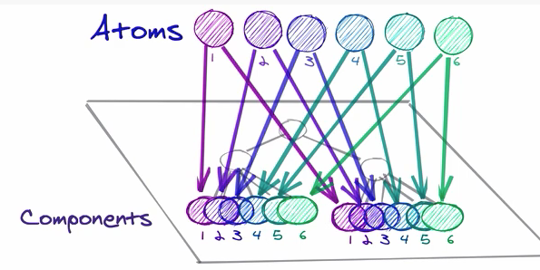

&nbsp; 리액트 상태 관리를 어떻게 하냐에 따라 의미 없는 리렌더 등 성능 이슈가 생길 수 있고 어떤 상태 라이브러리를 쓰며 어떤 구조로 상태를 설계해서 다루냐에 따라서 유지보수 관점에서 코드의 라이프 사이클이 크게 짧아질 수도 길어 질 수도 있다. 상태 설계는 만드는 개발자마다 중요하게 생각하는 지점이 갈릴 수 도 있고 한번 설계되면 프로젝트를 새로 만들지 않는 이상 고치기가 쉽지 않아서 깊은 고려를 하고 시작해야 되는 부분이다. 전역 상태 라이브러리로 `Redux`가 여전히 대세로 쓰이고 있고 많은 프로젝트에서 전역 상태가 무분별하게 사용되고 있다. 점차 전역 상태 라이브러리를 안쓰는 게 좋다는 흐름이 생기고 있고 리액트 팀에서는 `Recoil`을 만들어서 기존의 전역 상태 라이브러리를 대체 하려고 하고 있다. 리액트의 상태 관리가 어떻게 진행되어 왔고 어떻게 진행 되려고 하고 있는지 또, 어떤 식으로 설계되는게 추천 되는지 써보려고 한다.

## 리액트 상태란 뭘까

---

&nbsp; 리액트 상태란 무엇일까 `Props` 는 컴포넌트간 전달 되지만 `State`는 컴포넌트 안에서 관리 되고 시간이 지나면서 바뀌는 동적인 데이터다. `State`는 해당 `State`를 기반으로 동작되는 모든 컴포넌트의 상위 컴포넌트에 존재하는 컴포넌트에 위치 되는게 추천 된다.

&nbsp; 리액트 상태는 크게는 `범위`와 `역할`로 나눠 볼 수 있다. `범위`의 측면에서 본다면 `State`가 몇몇 컴포넌트에 국한되서 영향을 주는 `지역 상태`와 많은 컴포넌트에 영향을 주는 `전역 상태`로 나눌 수 있다. `지역 상태`와 `전역 상태`의 구분은 상황에 따라 상대적일 수 있다. `역할`의 측면에서 본다면 어플리케이션의 인터렉티브한 부분을 컨트롤하는 `UI 상태`, 서버로부터 데이터를 가져와 캐싱 해놓는 `서버 캐시 상태`, Form의 로딩, Submitting, disabled, validation 등등 데이터를 다루는 `Form 상태`, 브라우저에 의해서 관리되고 새로고침해도 변함 없는 `URL 상태` 등이 있다.

## 리액트 상태 관리의 역사

---

&nbsp; 기존의 UI 상태 관리는 `MVC (Model-View-Controller) 설계`를 써서 UI 를 관리 했었다. `양방향` 데이터 흐름을 가지고 있었기 때문에 `모델` 상태가 바뀌면 `뷰`가 바뀌며 `뷰`에서 변경이 일어난다면 다시 `모델` 상태가 바뀌며 `컨트롤러`가 이를 조작했다. `모델`하나에 의존되는 `뷰`가 많아지면 많아 질수록 `컨트롤러`의 복잡도는 더 올라갔고 최신 프론트 웹 개발 트렌드에서 UI 인터렉션이 많아지면서 `MVC 설계`는 관리가 불가능한 구조가 되었다.

&nbsp; 2013년, `MVC` 어플리케이션이 가지는 복잡도를 해결하기 위해 `단방향` 데이터 흐름을 가지는`리액트`를 릴리즈 하게 된다. 이때는 전역 상태 라이브러리가 존재 하지 않았기 때문에 상위 컴포넌트에서 `State`를 선언하고 하위 컴포넌트로 `Props`로 내려주면서 관리 했다. 어플리케이션이 커지면서 점차 래핑되는 컴포넌트도 많았고 `State`를 전달하기위해서 중간에 있는 관계없는 중간 컴포넌트까지 지나가면서 `State`를 `Props`로 전달했다. (이런 문제를 [Prop Drilling](https://kentcdodds.com/blog/prop-drilling) 이라고 부른다)

&nbsp; 2014년, 페이스북은`MVC 패턴`의 대안으로 `단방향`으로 데이터 흐름 진행되는 `Flux 패턴`을 공개 했다. `Flux 패턴`은 `MVC 패턴`에 있던 `상태의 전이`(뷰와 모델 사이의 데이터 변경이 연결된 수많은 곳으로 따라 변경되는 현상) 현상을 없애주고 `예측 가능`하다는 특징이있다.

&nbsp; 뷰 라이브러리의 발전과 함께 상태가 복잡한 웹 어플리케이션들이 생겨났고 고도화된 전역 상태 관리에 대한 필요성이 생기고 있었다. 2015년에는 Dan Abramov에 의해서 `React` + `Flux`의 구조에 `Reducer`를 결합한 `Redux`가 등장했다. `Redux`는 리액트, 앵귤러, 바닐라 js든 다 이용이 가능한 라이브러리이고 리액트와는 `react-redux`를 이용해서 바인딩 된다. `Redux`는 리액트의 `Prop Drilling` 문제와 여러 복잡해지는 상태 공유에 따른 컴포넌트간 의존성 문제를 해결할 대안으로 떠올랐고 금세 상태 관리 라이브러리의 대세가 되었다.

&nbsp; 그후 리액트 `Hooks`가 나왔고 `Context API`를 이용해서 `Prop Drilling` 문제 해결, 역할에 따른 `상태 분리` 등이 가능해졌다. `React Query`, `SWR` 등이 나와서 기존에 `Redux`에 캐싱되어있던 서버 상태를 분리해서 캐싱 하고 있고 최근 리액트 팀은 리액트 전용 전역 라이브러리인 `Recoil`을 개발중에 있다.

## 좋은 리액트 상태 관리란 뭘까

---

&nbsp; `State`는 관련 컴포넌트들과 최대한 가까이 배치 되는게 좋다. ( [State Colocation will make your react app faster](https://ideveloper2.dev/blog/2019-10-12--state-colocation-will-make-your-react-app-faster/) ) `State`가 관련 컴포넌트와 멀어질수록 상태와 컴포넌트 사이에 있는 관련 없는 컴포넌트의 리렌더까지 일으킬 위험이 크다. 또 `State`들은 관심사에 따라 잘 분리가 되야 후에 코드 수정시 사이드 이펙트를 최소화 할 수 있다. 서로 관련 없는 컴포넌트들의 상태가 한번에 관리되면 결합도가 높아지게 되고 후에 어플리케이션이 비대화 될수록 의도치 않은 영향을 줄 수 있는 가능성이 높아진다. 코드들은 격리되어 있지 않아 코드의 재사용성 또한 떨어진다.

### 전역 상태의 문제점

&nbsp; `Redux` 같은 전역 상태 라이브러리를 꼭 써야되는지 고려해봐야 한다. 전역 상태를 이용한다면 전역 `State`가 바뀔때마다 리렌더가 일어날 수 있다. (이를 최적하기 위한 `react-redux`의 권장 사항과 `redux hooks`들도 있다.) `Reducer`를 역할에 맞게 쪼갤수도 있지만 결국 하나의 `State`에서 관리되고 내가 보낸 `Dispatch`는 모든 `Reducer`를 통하게 되기 때문에 상태의 관심사에 따른 분리가 제대로 일어나고 있는지도 의문이다.

### Redux의 한계

&nbsp; `Redux`는 안정적인 상태 유지를 위해서 강한 제약을 요구한다. "무엇이 일어나는가"와 "어떻게 바꾸는가"를 분리하기 위해 빙 돌아가는 방식을 추가하는 것이 `Redux`가 제안하는 요구사항이다. 어플리케이션 상태 / 무엇이 일어나는 지 / 어떻게 바꾸는 지 구분 해서 개발 해야한다. 무엇이 일어나는지는 `dispatch`를 이용해서 알리며 어떻게 바꿀지는 `reducer`를 이용해서 `state`를 조작한다. `Flux` 패턴을 이용해서 단방향 흐름으로 안정적인 상태 운용이 가능하지만 원하는 상태와 기능추가를 위해서는 `dispatch`를 위한 `action`, 상태 변화를 위한`reducer`, 컴포넌트에서 `state`를 가져다 쓰는 부분 모두 손봐야 하기 때문에 너무 장황하다. 어플리케이션이 비대화 될수록 이런 상태 관리 사이클 관리를 위한 코드의 복잡도가 심화되어서 확장성도 떨어진다.

### 서버 캐싱을 전역 상태 라이브러리로 하면 안되는 이유

&nbsp; 서버 캐싱을 위해서 전역 상태 라이브러리를 쓰는 경우가 많다. `Redux`에서는 비동기 API 호출을 전역 상태에 담기위해서 `redux-thunk`, `redux-saga` 등 미들웨어 라이브러리들이 쓰이고 있다. 하지만 본질적으로 `서버 캐시`와 `UI 상태`는 다르다. `서버 캐싱` 되는 데이터는 본래 서버에 저장되어 있고 빠른 접근을 위해 클라이언트에 저장하는 상태이다. 예를 들면 서버에서 가져오는 유저 데이터 등이 있다. 반면, `UI 상태`는 오로지 우리 앱의 인터렉션을 제어하기 위한 UI에서만 유용한 상태다. 예를 들면, Modal의 isOpen 과 같은 데이터이다. 둘은 섞이면 안되고 본질에 따른 분리가 필요하다.

&nbsp; 또, `전역 상태`에서 `서버 상태`를 캐싱을 하게되면 `서버 상태`가 특정 시점에 `캡쳐` 되버린다. 서버 데이터를 캐싱한 클라이언트의 상태를 인터렉션에 따라 update해서 서버 데이터와 동기화 한다고 하여도 시간이 지남에 따라서 본질적으로는 다른 데이터가 되고 관리도 어렵다.

&nbsp; 전역 상태 라이브러리에서 `서버 상태`를 캐싱 하기 위해서 전역에서 호출이 강제 될 수 있다. `전역 상태`에서 서버 데이터를 저장하기 위해서 미리 초기화 시점에 최상단 컴포넌트에서 호출을 해서 저장을 하기 때문에 데이터를 쓰는 시점과 데이터를 호출 하는 시점이 달라 질 수 있다. 이는 데이터에 접근하는 시점에 데이터가 있음을 보장할 수 없게 되고 애플리케이션의 크기가 커지면 커질수록 데이터의 흐름을 따라가기 힘들게 된다.

&nbsp; 전역 상태에서 서버 상태를 관리하지말고 `SWR`, `React-Query` 등과 같은 서버 캐싱 전용 라이브러리를 사용해야한다. 서버 캐싱은 아주 어려운 작업이다. `custom hooks`를 만들어서 따로 넣을수도 있겠지만 진정한 캐싱의 개념을 쓰기 위해서는 라이브러리의 도움을 받는게 좋다. 주기적으로 정해진 시점에 따라 데이터가 `out-of-date`이 되지않게 서버 데이터를 `polling`을 하고 에러가 나면 영리하게 재호출 할수도 있다. 서버 응답을 메모리에 캐싱하면서 재검증 로직과 함께 비용을 줄인다. 또 원하는 시점에 호출을 하기 때문에 해당 데이터를 이용하는 컴포넌트에서 직접 호출을 하게된다. 전역 컴포넌트의 상태로부터 독립된 컴포넌트는 재사용이 가능하게 된다.

> _Redux 진영 에서도 21년 6월부터 Redux 툴킷에 RTK Query라는 모듈을 새로 추가 했습니다. API 호출 캐싱을 기존의 전역 상태관리와 분리해서 관리 할 수 있게 지원하고 있습니다_ [관련 글](https://medium.com/@kolbysisk/react-state-management-in-2022-return-of-the-redux-87218f56486b) _( 2021.12.07 추가한 글 )_

## 리액트 전역 UI 상태 관리

---

### 전역 상태 언제 필요할까

&nbsp; 위에서 다룬 것 같이 일반적인 경우 상태는 `전역 상태`보다 관련 컴포넌트 가까운 `지역 상태`로서 관리되는게 권장된다. `Prop Drilling` 과 같은 이슈도 간단하게는 [리액트 함수 합성](https://www.notion.so/a1ed23b1674a4cb482a2bdb6e278281d)을 이용해서 해결 가능하다. 하지만 다수의 컴포넌트간에 상태 의존성이 높아진다면 `지역 상태`로서 관리 되기 어려울 수도 있다. 이때는 `전역 상태`를 이용하는것도 좋다. 또, 언어나 다크 모드같은 변화가 잦지 않고 서비스 전반에 걸친 상태면 `전역 상태`를 이용 할 수 있다. 상태는 본인의 기준에 의해 개발자가 설계하게 되는 것이며 뭐든 절대적인 것은 없다. 하지만 한번 설계된 상태는 어플리케이션의 코드 라이프 사이클 동안 계속 다뤄지는 부분이기 때문에 신중해야한다.

### 전역 상태 관리한다면 꼭 Redux 여야 할까

- 한번 자리 잡은 Redux의 인기는 여전하다

&nbsp; 위에서 다룬 것 처럼 `Redux`는 한계가 있음에도 여전히 가장 많이 쓰이는 상태관리 라이브러리이며 대다수의 리액트 프로젝트에는 `Redux`로 전역 상태가 관리 되고 있다. 인기가 가장 많기 때문에 강한 생태계를 구축하고 있어서 tool도 많고 미들웨어도 많이 존재한다. `Recoil`과 `Jotai`와 다르게 SSR 까지 지원되고 있다. `Flux` 패턴을 이용한 선언적이고 안정적인 상태 운용을 원한다면 `Redux`를 이용해도 된다. `Redux`도 기존의 장황한 확장성을 고치기 위해 `Redux Tools`라는 새로운 기능을 만들어서 한번에 무엇을 어떻게 할지 정의할수 있게 했다. 이를 통해 좀더 간결하게 상태 관리 할 수 있도록 개선 되었다.

### 간단한 대안 Context API

&nbsp; 리액트 hooks가 나오면서 비대한 `Redux`대신 `Context`를 활용해서 개발하는 게 권장 되고 있다. `Context`는 수단일 뿐 사실상 상태관리 자체는 리액트 컴포넌트의 `useState`와 `useReducer` 로 하게 된다. 역할에 맞게 여러 `Provider`를 쪼개서 관리 할 수 있고 또 관련된 컴포넌트 들의 상위에 `Provider`를 감싸면 되기 때문에 전역 상태가 최상단에 위치하는 `Redux`보다 가까이서 상태를 관리 할 수 있게된다.

하지만 `Context`도 문제가 있다. `Redux`는 의존해서 사용하는 값이 변할때 리렌더링이 되도록 최적화 되어있지만 `Context`의 경우 해당 값 말고 다른 값이 변경될때도 컴포넌트는 재호출 되어서 리렌더링이 발생한다. `Context`를 다룰때에는 꼭 관심사에 따라 모두 다 분리해서 관리 해야한다. 하지만 어플리케이션이 비대화 될수록 관심사가 많아지면 관리하기 어려울정도로 래핑이 많아지는 문제가 있다. 중첩되는 컴포넌트들이 많아지니 성능 이슈도 생긴다.

- 출처 : 리코일 왕위를 계승하는 중입니다 - 김태곤

&nbsp; 위의 복잡한 `Context` 구조처럼 거대한 프로젝트를 다루기에는 해법으로 제시한 `ContextAPI`도 명확한 한계를 가지기 때문에 리액트 팀은 `Recoil`을 만들기 시작한다

### Recoil

&nbsp; `Recoil`은 `Redux` `MobX`등의 서드파티 라이브러리와 다르게 오직 리액트 만을 위해서 생겨난 라이브러리이다. 서드 파티 라이브러리들은 외부에서 상태를 관리한뒤 `react-redux`등을 통해서 리액트 라이프 사이클에 접근했지만 `Recoil`은 깊은 부분까지 리액트 상태를 직접 다룬다. 페이스북이 직접 개발하기 때문에 장기적으로 [동시성 모드](https://ko.reactjs.org/docs/concurrent-mode-intro.html)나 [Suspense](https://ko.reactjs.org/docs/concurrent-mode-suspense.html) 같은 리액트의 실험적 기능 까지 확대할 목적으로 개발 되고 있다. 서드파티 라이브러리를 쓰게되면 리액트의 내부 스케줄러에는 접근할수 없어서 내부 성능 로직 개선이 어렵게 된다.

`Recoil`을 쓰게되면 `Atom`이라는 작은 데이터 조각을 만들어서 해당 `State` 변화 시에 이를 참조하는 컴포넌트들만 리렌더를 시키는 단순한 로직으로 되어있다. 아직은 디버깅 Tool들이 미미하고 안정화가 덜되어 있지만 조만간 안정화 되면서 빠른 속도로 `Redux`를 대체할 것으로 보인다.

## 마치며

---

&nbsp; 필자가 공부를 시작한 2019년만 하더라도 `Redux` 사용은 거의 강제되었고 많은 프로젝트를 큰 고민 없이 `Redux`로 다뤄 왔었다. 이제는 `Redux`가 아닌 관심사에 따른 상태 분리 같은 것들이 중요시 된다는 걸 느끼면서 프론트 웹 생태의 빠른 변화를 새삼스레 느끼게 되었다. 이제는 전역 상태보다는 지역 별로 잘 분리된 상태관리가 권장되고 있다. 그럼에도 전역 상태 관리가 필요한 상황들이 많기 때문에 만들어지는 `Recoil`이 불러올 또 하나의 리액트 개발 패러다임도 기대해 본다.

---

23/07/07 추가 : 

- recoil은 페이스북에서 관리를 멈추고 오픈소스화하려는 움직임을 보이고 있다. 4/12일 이후 라이브러리 업데이트가 안되고 있는 것으로 보아 진척이 없어 보인다. 지금 시점에서는 업데이트가 활발히 되고있는 Jotai나 Zustand를 추천한다
  - [Is the project still maintained?](https://github.com/facebookexperimental/Recoil/discussions/2171)

### 참고글

---

[Recoil - 또 다른 React 상태 관리 라이브러리?](https://ui.toast.com/weekly-pick/ko_20200616)

[Recoil: 왕위를 계승하는 중입니다 (새로운 React 상태 관리 라이브러리)](https://tv.naver.com/v/16970954/list/657024)

[당신에게 Redux는 필요 없을지도 모릅니다.](https://medium.com/lunit/%EB%8B%B9%EC%8B%A0%EC%97%90%EA%B2%8C-redux%EB%8A%94-%ED%95%84%EC%9A%94-%EC%97%86%EC%9D%84%EC%A7%80%EB%8F%84-%EB%AA%A8%EB%A6%85%EB%8B%88%EB%8B%A4-b88dcd175754)

[리덕스(Redux)는 왜 쓰는 건데⁉](https://wooder2050.medium.com/%EB%A6%AC%EB%8D%95%EC%8A%A4-redux-%EB%8A%94-%EC%99%9C-%EC%93%B0%EB%8A%94-%EA%B1%B4%EB%8D%B0-2eaafce30f27)

[Redux 를 넘어 SWR 로(1)](https://min9nim.vercel.app/2020-10-03-swr-intro1/)

[전역 상태 관리에 대한 단상 (stale-while-revalidate)](https://jbee.io/react/thinking-about-global-state/)

[Past, Present, and Future of React State Management - Lee Robinson](https://leerob.io/blog/react-state-management?fbclid=IwAR2jI5klYjGLoJXuOLcMIctncQuniOgMQIwmwEIb65T-C3x0-erc86Jvu00)

[단일 진실 공급원 - 위키백과, 우리 모두의 백과사전](https://ko.wikipedia.org/wiki/%EB%8B%A8%EC%9D%BC_%EC%A7%84%EC%8B%A4_%EA%B3%B5%EA%B8%89%EC%9B%90)

[React로 사고하기 - React](https://ko.reactjs.org/docs/thinking-in-react.html)
