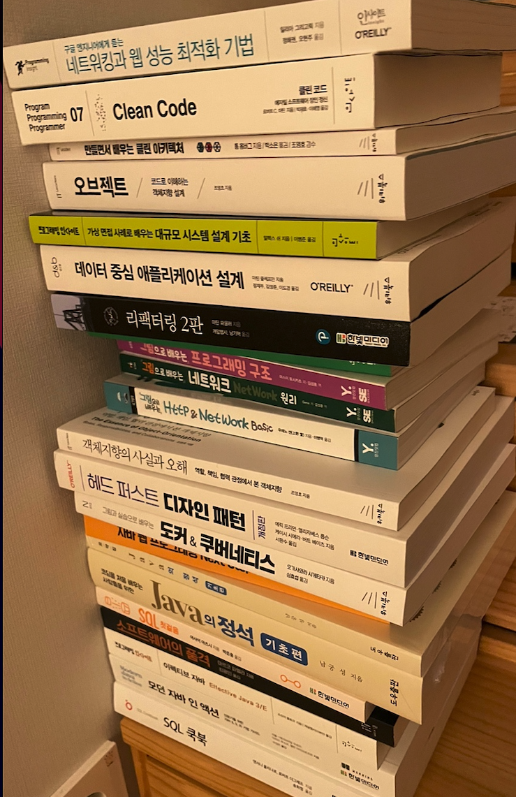

&nbsp; 나는 지금 3년차 프론트앤드 개발자다. 프론트앤드 기술이 어느 정도 익숙해진 상태고 리액트 컴포넌트 설계나 상태 관리, 성능 등에 대해 많은 공부와 고민을 하였고 관련 블로그 글도 많이 올렸다. 백앤드 관련한 서버 기술에 대해서는 대략적인 플로우만 알고 Express나 NestJs를 이용해서 몇 번 따라서 구현만 해본 수준이다. 그렇기 때문에 실무에서 서버 관련 이슈를 만날 때는 지레 겁먹은 적도 많다. 서버로 렌더링을 하는 SSR 같은 경우도 뭔가 막연히 서버를 알고 있기 때문에 이미 서버 관련해서 미리 세팅돼 있는 프레임워크에 많이 의존하는 편이다. 사실 이정도만 알아도 개발자가 많은 큰 회사에서는 분업이 잘되어 있기 때문에 프론트앤드 개발자로서 실무를 행하는 데 큰 문제는 없다. 하지만 나는 갑자기 백앤드 관련 공부를 하고 싶어졌다.

## 백앤드를 공부하기로 마음 먹은 이유

&nbsp; 첫번째, 나는 웹 개발자기 때문에 알아야 한다. 프론트앤드 기술을 주로 다루지만 백앤드 기술이 전무하다면 웹 개발자라고 할 수 없다.  스스로 웹 개발자로 칭하는 것을 부끄럽지 않기 위해서 웹 관련 기술을 충분히 공부해야 한다. 나도 많은 웹 개발 지원자들과 마찬가지로 프론트앤드부터 웹 개발을 시작했고 그래도 꾸준히 업계에서 통용되는 웹 기술들을 공부한다고 했었지만 프론트앤드 관련 기술에 치중했었다. 그래서 더 넓은 범위의 공부가 필요하다. 또, 최근 프론트앤드의 많은 이슈들도 점차 브라우저에서 서버 쪽으로 렌더링이나 뷰 모델 구축 프로세스를 넘기면서 문제를 해결하려는 경향을 보이고 있다. 브라우저만 신경쓰던 프론트개발자들에게 서버 프로세스도 더이상 무시할 수 없는 이슈가 되고 있다.

&nbsp; 두번째, 오랜기간 쌓여온 개발 철학(이지만 나에게는 새로운 기술)들을 배우고 싶다. 최근 아키텍쳐를 공부하고 싶어서 책을 몇 권 샀지만 죄다 백앤드 관련한 아키텍쳐 책이라서 이해하기가 어려웠다. 백앤드 공부를 통해서 좀 더 넓은 분야까지 공부를 할 수 있다. 프론트앤드의 새로운 기술도 좋긴 하지만 프론트앤드라는 분야가 최근 제일 가장 빠르게 기술이 빠르게 흘러 가고 프론트앤드만의 기술 철학이 막 적립되어가는 시점이라 이전의 개발 철학을 쉽게 적용하기 어렵다. 또, 자료도 많이 없다. 그런 의미에서 백앤드 기술을 통해 조금 더 오랜 개발의 철학들을 공부할 수 있다.

&nbsp; 세번째, 개발자를 하는 동안 내가 어떤 개발을 할 지 모른다.  좀 더 많은 분야를 알게 되면 더 많은 기회를 얻을 수 있다. 해외 취업도 대부분 백앤드 개발자 위주로 채용이 되고 있어서 다른 기회를 얻을 수 있다. 궁극적으로는 많은 기술을 가지고 있을수록 더 오래 개발자 생활을 할 수 있다.

&nbsp; 네번째, 왠지는 모르겠지만 내가 백앤드 공부를 하는 모습이 꿈에 나온다. 가끔 가보지 않은 미지의 세계에 도전하고 싶을 때는 이런다. 호주에 워킹홀리데이를 가기전에도 그랬고 회계사 공부를 중단하고 개발자를 시작할 때도 그랬다. 성격상 이럴때는 한번 해봐야 된다.

## 자바와 스프링으로 공부하는 이유

&nbsp; 자바, 스프링하면 거부감이들 개발자들이 많다. 나도 그랬다. 학부때는 게임개발 지망생이였고 자연스레 자바보다는 C나 C++이 더 친했던 것 같다. 교수님들이 졸업 중에 꼭한번이라도 자바를 해볼 수 있도록 트랙을 만들어 놓으셨지만 미꾸라지마냥 피해서 졸업에 성공했다. 졸업 후에도 자바가 왠지 구닥다리같고 못생겨보여서 자바 공부하는 것에 회의적이였다. 하지만 지금은 생각이 조금 바뀌어서 자바와 스프링으로 백앤드를 공부해보려고 한다. 왜 생각이 바뀌었을까

&nbsp; 첫번째, 자바 스프링은 노드와 다르게 한글로 된 배울 자료들이 엄청 많다. 자바스크립트로도 물론 백앤드 공부를 할 수 있다. 노드환경에서 백앤드 구축이 가능하고 NextJS같은 추상화가 잘되어있는 프레임워크도 최근 핫하다. 하지만 좋은 도구가 있음에도 배울 자료가 많이 부족한게 현실이다. 최근 자바에서 JS진영으로 넘어가서 백앤드 개발을 하고 계신 인프런의 이동욱님도 같은 고민을 하고 계셨다. 백앤드 기술을 다룬 명서들 대부분이 자바와 스프링을 기준으로 쓰여진 경우가 많기에 빠른 기술 습득을 위해서는 자바, 스프링이 유리하다고 생각한다.

&nbsp; 두번째, 기술보다 중요한 것은 메타다. 기술은 계속 발전하고 바뀐다. 그럼에도 프로세스는 대부분 유지되고 배운 기술과의 비교를 바탕으로 추가 공부가 이뤄진다. 최근 Rust를 조금 공부 했는데 Javascript와 Typescript를 공부한 지식을 바탕으로 배움이 확장되는 현상을 목격했다. 어떤 기술을 공부하면 내 안에서 어떤 메타 데이터가 축적되고 그것을 바탕으로 프로세스를 이해하고 새로운 관점을 가지게 된다. 자바, 스프링이 곧 다른 기술들로 대체 될순 있겠지만 그것을 공부하면서 얻은 인사이트들은 그대로 남아있을 것이다. 특히나 지금 쌓여있는 백앤드 관련 인사이트가 많은 자바, 스프링 진영에서는 새로운 기술의 진영보다 더 얻을게 많고 빨리 배울 수 있다.

&nbsp; 세번째, 한국에서 백앤드로 일하는데 있어서 핵심 언어다. 대부분 회사에서 자바, 스프링을 기반으로 서비스를 운영하고 있으며 성장하는 스타트업 같은 경우도 인력 채용 문제로 인해서 성장한 후에 자바, 스프링으로 전환하는 경우가 많다. 커뮤니티가 크고 활발해서 뭔가 세계에서 보기 드물게 자바 스프링 진영에서 선순환 구조가 일어나고 있다. 세계적으로도 크게 점유율이 떨어지지 않는 스테디 셀러다. 서비스의 백앤드 기반 기술은 프론트앤드 기반 기술 마냥 전환되기가 쉽지 않다. 아마 AWS같은 클라우드 서버리스 서비스에 뒤쳐지기 전에는 계속 쓰일듯 하다. 

## 잡썰

&nbsp; 사실 대기업에서 일하기 위해서는 프론트앤드나 백앤드 하나만 잘해도 상관없다. 큰 회사는 매우 분업이 잘되어있고 내가 담당하는 분야에 대해서만 강한 전문성을 요구한다. 오히려 둘 다 잘해도 하나의 기술은 퇴화될 가능성이 높다. 나는 졸업 후에 웹 개발을 시작했다. 후발주자로서 웹 개발에서 프론트앤드 분야는 빠르게 성장하고 빠르게 많은 포지션들이 열리고 있었기 때문에 매우 매력적인 분야였다. 또, 기술이 매우 빠른 속도로 교체 되기 때문에 어느 정도의 기본기만 있으면 부지런하게 새로운 기술을 정확하고 일찍 습득하는 사람일수록 좋은 대우를 받을 가능성도 높아진다. 프론트앤드, 백앤드가 섞여서 인턴십을 하는 회사에서 동기들과 함께 시작했다. 기회가 상대적으로 더 많았기에 프론트앤드 개발 동기들이 먼저 큰 회사에 들어가는 것도 볼 수 있었다.

&nbsp; 개발자는 문제를 해결하는 사람이다. 나는 어느 수준의 문제까지 해결이 가능할까? 프론트 개발자들은 화면의 `TTI(Time To Interact)`를 빠르게 하기 위해 노력하고 UX적인 관점까지 생각해서 사용자 중심으로 먼저 문제를 해결하고 싶어한다. 백앤드 개발자들은 어떨까? 사용자들을 위해서는 높은 수준의 트래픽을 처리하고 서비스가 무너져도 일부는 버티게끔 해야한다. 사용자는 넓게보면 동료 개발자 일수도 있다. 백앤드 개발자가 만든 API를 프론트앤드 개발자가 가져다가 화면을 그리기 때문에 또 그에 맞는 좋은 사용자 경험도 만들어 내야 한다. 두 분야 모두 문제 해결이라는 본질은 같다! 나는 좀 더 내 한계를 시험해서 더 넓은 문제 해결을 해보고싶다.

## 마무리

책과 강의부터 잔뜩 쌓아 놓고 시작한다. 오랜만에 하는 챌린지라 설렌다! 좋은 결과가 있으면 좋겠다.